# PUB095 : Applications mobiles avec React Native, 2025

# PUB095 : Applications mobiles avec React Native, 2025

---

Généré le 16 août 2026
par Sébastien Trottier.

Les commentaires ne sont pas inclus.

# Table des matières

[1. Applications mobiles multiplateformes](https://apical.xyz/formations/pageunique/applications_mobiles_avec_react_native20251210101311#chapitre-applications_mobiles_multiplateformes20251210101311)  
[2. Installation de React Native](https://apical.xyz/formations/pageunique/applications_mobiles_avec_react_native20251210101311#chapitre-installation_de_react_native20251210101311)  
[3. Création et lancement d'un projet React Native](https://apical.xyz/formations/pageunique/applications_mobiles_avec_react_native20251210101311#chapitre-creation_d_un_projet_react_native20251210101311)  
[4. Les émulateurs et appareils physiques](https://apical.xyz/formations/pageunique/applications_mobiles_avec_react_native20251210101311#chapitre-les_emulateurs_et_appareils_physiques20251210101311)  
[5. VS Code](https://apical.xyz/formations/pageunique/applications_mobiles_avec_react_native20251210101311#chapitre-vs_code)  
[6. Initiation à React Native](https://apical.xyz/formations/pageunique/applications_mobiles_avec_react_native20251210101311#chapitre-initiation_a_react_native20251210101311)  
[7. Les composants du noyau (core components)](https://apical.xyz/formations/pageunique/applications_mobiles_avec_react_native20251210101311#chapitre-les_composants_du_noyau_core_components20251210101311)  
[8. Rendu conditionnel](https://apical.xyz/formations/pageunique/applications_mobiles_avec_react_native20251210101311#chapitre-rendu_conditionnel20251210101311)  
[9. Déboguer une application React Native](https://apical.xyz/formations/pageunique/applications_mobiles_avec_react_native20251210101311#chapitre-deboguer_une_application_react_native20251210101311)  
[10. Les hooks](https://apical.xyz/formations/pageunique/applications_mobiles_avec_react_native20251210101311#chapitre-les_hooks_00220251210101311)  
[11. Composants parents vs enfants](https://apical.xyz/formations/pageunique/applications_mobiles_avec_react_native20251210101311#chapitre-composants_parents_vs_enfants20251210101311)  
[12. La navigation](https://apical.xyz/formations/pageunique/applications_mobiles_avec_react_native20251210101311#chapitre-la_navigation20251210101311)  
[13. Les données locales](https://apical.xyz/formations/pageunique/applications_mobiles_avec_react_native20251210101311#chapitre-les_donnees_locales20251210101311)  
[14. Accéder à la base de données de l'émulateur](https://apical.xyz/formations/pageunique/applications_mobiles_avec_react_native20251210101311#chapitre-acceder_a_la_base_de_donnees_de_l_emulateur20251210101311)  
[15. Formulaire React Native](https://apical.xyz/formations/pageunique/applications_mobiles_avec_react_native20251210101311#chapitre-formulaire_react_native20251210101311)  
[16. Confirmation avant suppression](https://apical.xyz/formations/pageunique/applications_mobiles_avec_react_native20251210101311#chapitre-confirmation_avant_suppression_00420251210101311)  
[17. Quelques réflexions](https://apical.xyz/formations/pageunique/applications_mobiles_avec_react_native20251210101311#chapitre-quelques_reflexions20251210101311)  
[18. Les capteurs](https://apical.xyz/formations/pageunique/applications_mobiles_avec_react_native20251210101311#chapitre-les_capteurs_00220251210101311)  
[19. Utiliser un API](https://apical.xyz/formations/pageunique/applications_mobiles_avec_react_native20251210101311#chapitre-utiliser_un_api20251210101311)  
[────────── Chapitres de référence ──────────](https://apical.xyz/formations/pageunique/applications_mobiles_avec_react_native20251210101311#chapitre-chapitres_de_reference_00920251210101311)  
[20. Dépannage React Native (troubleshooting)](https://apical.xyz/formations/pageunique/applications_mobiles_avec_react_native20251210101311#chapitre-depannage_react_native_troubleshooting20251210101311)  
[21. Quelques notions JavaScript](https://apical.xyz/formations/pageunique/applications_mobiles_avec_react_native20251210101311#chapitre-quelques_notions_javascript)  
[22. Quelques bibliothèques utiles](https://apical.xyz/formations/pageunique/applications_mobiles_avec_react_native20251210101311#chapitre-quelques_bibliotheques_utiles20251210101311)  
[23. Recréer certains dossiers du projet](https://apical.xyz/formations/pageunique/applications_mobiles_avec_react_native20251210101311#chapitre-recreer_certains_dossiers_du_projet_002)  
[24. ESLint et Prettier](https://apical.xyz/formations/pageunique/applications_mobiles_avec_react_native20251210101311#chapitre-eslint_et_prettier20251210101311)  
[25. Code propre à une plateforme](https://apical.xyz/formations/pageunique/applications_mobiles_avec_react_native20251210101311#chapitre-code_propre_a_une_plateforme20251210101311)

# 1. Applications mobiles multiplateformes

## 1.1 Développement natif vs multi-plateformes

Le développement natif pour iOS ou pour Android permet de développer une application mobile qui :

* respecte l'apparence et les comportements habituels de la plateforme (look and feel)
* offre les meilleures performances
* peut tirer avantage de toutes les fonctionnalités du système d'exploitation natif et de l'appareil utilisé
* utilise un cadre d'application dont les risques de disparition sont quasi-nuls

Par contre, le développement natif offre des défis :

* temps de développement et de maintenance beaucoup plus élevé si l'application doit être développée pour iOS et pour Android
* difficile de trouver des spécialistes dans l'un et l'autre des environnements
* courbe d'apprentissage abrupte

De façon globale, on pourrait dire que le développement natif est idéal si vous avez une équipe de développeurs bien établie pour chacun des systèmes visés.

Pour sa part, le développement multiplateformes devrait être priorisé si vous avez une petite équipe de développement et des ressources limitées.

## 1.2 Différentes approches pour applications multiplateformes

Les outils qui permettent de développer des applications mobiles pour iOS ou pour Android à l'aide du même code peuvent utiliser différentes approches.

## Coquille alentour d'une application Web

Cette approche est intéressante puisqu'elle n'implique pas de développer une nouvelle application mobile. Le même code HTML, CSS et JavaScript sera utilisé pour le site Web, l'application iOS et l'application Android.

[Apache Cordova](https://cordova.apache.org/) (anciennement PhoneGap) utilise ce principe.

Cependant, ceci se fait à un coût :

* Puisque l'application est en fait une coquille alentour d'un site Web, l'aspect et le comportement (look and feel) de l'application sera différent des standards de la plateforme.
* Il y aura un petit délai d'exécution puisqu'une couche logicielle doit faire le lien entre le Web et le mobile.
* Il n'est pas possible de travailler avec plus d'un fil d'exécution.
* ...

## Pont JavaScript entre l'application et le langage natif

React Native, développé par Facebook en 2015, utilise ce principe.

Les applications React Native offrent des performances qui se rapprochent de celles d'une application native.

## Compilation vers le code machine

Flutter, développé par Google en 2017, utilise cette approche.

Les applications Flutter offrent un aspect et un comportement qui se rapprochent de ceux d'une application native.

## Pour plus d'information

« Top 10 Best Cross-Platform App Development Frameworks ». Tech Ahead. <https://www.techaheadcorp.com/blog/best-cross-platform-app-development-frameworks/>

« A Comparison of Flutter Vs. React – An Overview ». Techtiz. <https://techtiz.co/blogs/a-comparison-of-flutter-vs-react/>

# 2. Installation de React Native

## 2.1 React Native

React Native utilise le langage de programmation JavaScript.

Si vous avez déjà développé une application Web avec React, vous réussirez à coder en React Native rapidement.

Avec React Native, votre code vous permettra de créer une application pour Android et pour iOS mais à certaines conditions.

D'abord, pas la plupart des situations, vous aurez besoin d'un ordinateur Apple pour tester et pour publier une application pour iOS.

Ensuite, il faudra probablement apporter quelques modifications au code afin de le rendre optimal pour Android ou pour iOS. Le but est d'obtenir une application qui est le plus près de l'apparence et du comportement par défaut de la plateforme.

> React Native’s tagline, “Learn once, write anywhere” differs from the usual cross-platform mantra, “Write once, run anywhere.”[1](https://www.toptal.com/mobile/comparing-react-native-to-cordova#:~:text=React%20Native%E2%80%99s%20tagline)

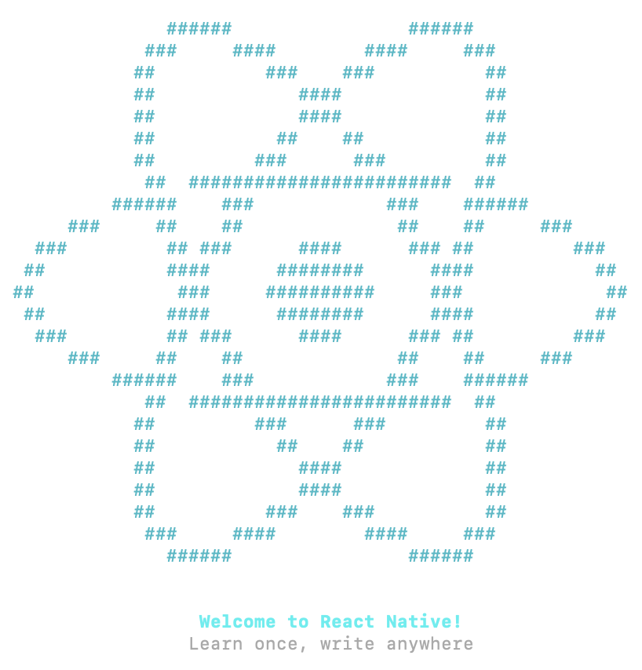

## Source

1. « The Duel: React Native vs. Cordova ». Toptal. [https://www.toptal.com/mobile/comparing-react-native-to-cordova](https://www.toptal.com/mobile/comparing-react-native-to-cordova#:~:text=React%20Native%E2%80%99s%20tagline)

## Pour plus d'information

« React Native Beginners Tutorial—A Cold Dive ». Toptal. <https://www.toptal.com/react-native/cold-dive-into-react-native-a-beginners-tutorial>

« The Ultimate React Native Tutorial ». Simpli Learn. <https://www.simplilearn.com/react-native-tutorial-article>

« Créer une application React Native ». Grafikart. <https://grafikart.fr/tutoriels/react-native-pokedex-2245>

« Formation React ». Dyma. <https://dyma.fr/formations/react>

## 2.2 Installation de React Native

Pour développer une application React Native, vous aurez besoin de quelques morceaux. Les détails d'installation sont fournis plus bas, je vous donne ici simplement une vue d'ensemble pour vous aider à comprendre.

Vous pouvez utiliser l'éditeur de votre choix pour développer votre application mais vous aurez besoin d'Android Studio pour gérer les émulateurs.

Notez qu'ici, j'ai choisi de ne pas utliser [Expo](https://expo.dev/), un écosystème d'outils pour React Native.

Pour comprendre ce que l'utilisation d'Expo implique, lisez ceci : <https://upstackhq.com/blog/software-development/should-i-use-expo-for-react-native>.

Dans cette fiche :

* [Programmation pour Android](https://apical.xyz/formations/pageunique/applications_mobiles_avec_react_native20251210101311#android)
* [Programmation pour iOS](https://apical.xyz/formations/pageunique/applications_mobiles_avec_react_native20251210101311#ios)
* [Installation](https://apical.xyz/formations/pageunique/applications_mobiles_avec_react_native20251210101311#installation)
* [Vérification](https://apical.xyz/formations/pageunique/applications_mobiles_avec_react_native20251210101311#verification)
* [Création d'un projet React Native](https://apical.xyz/formations/pageunique/applications_mobiles_avec_react_native20251210101311#projet)

## Programmation pour Android

Les morceaux requis sont :

* Un ordinateur Windows ou macOS
* Android Studio ou IntellilJ (requis pour construire l'application et pour fournir un émulateur)
* Android
* Node LTS
* Java SE Development Kit (JDK)
* L'interface en ligne de commande de React Native (React Native CLI - Command Line Interface)
* Un IDE de votre choix

## Programmation pour iOS

Les morceaux requis sont :

* Un ordinateur macOS
* Xcode (requis pour construire l'application et pour fournir un émulateur)
* Xcode command Line Tools
* CocoaPods
* Node
* Watchman
* Java SE Development Kit (JDK)
* L'interface en ligne de commande de React Native (React Native CLI - Command Line Interface)
* Un IDE de votre choix

## Installation

Voici quelques précisions sur l'installation. Je n'ai traité que l'installation sous Windows. Je vous conseille d'en faire une lecture mais de ne rien faire à l'ordinateur pour l'instant puisque les étapes d'installation officielles pourraient différer.

Après en avoir pris connaissance, suivez les instructions d'installation pour votre système d'exploitation : <https://reactnative.dev/docs/set-up-your-environment>.

Notez qu'il est également possible d'[apical\_lien\_interne][react\_native\_et\_docker,installer React Native dans un conteneur Docker][/apical\_lien\_interne].

* Ouvrez la fenêtre Terminal en mode administrateur.
* Effectuez cette configuration qui vous permettra de lancer des commandes dans une fenêtre Terminal :

  Terminal

  Set-ExecutionPolicy Unrestricted -Scope CurrentUser -Force
* Installez chocolatey (<https://chocolatey.org/install>) :

  Terminal

  Set-ExecutionPolicy Bypass -Scope Process -Force; [System.Net.ServicePointManager]::SecurityProtocol = [System.Net.ServicePointManager]::SecurityProtocol -bor 3072; iex ((New-Object System.Net.WebClient).DownloadString('https://community.chocolatey.org/install.ps1'))
* Installez JDK :

  Terminal

  choco install -y nodejs-lts microsoft-openjdk17
* Installez Git (sinon, quand on crée un projet, on obtient le message « Git is not installed on your system. This might cause some features to work incorrectly ») :

  Terminal

  choco install git.install
* Les instructions officielles demandent d'installer Android Studio en cochant Android SDK, Android SDK Platform et Android Virtual Device. Puisque vous avez déjà installé Android Studio, pas de problème. Les étapes suivantes assureront que tout est conforrme en plus de compléter l'installation requise.
* Démarrez Android Studio.
* Cliquez sur les trois points verticaux sur l'écran d'accueil puis choisissez SDK Manager (ou, si un projet est déjà ouvert, File / Settings / Languages & Frameworks / Android SDK).
* Dans l'onglet SDK Platforms, cochez Show Package Details.
* Plusieurs versions du SDK peuvent coexister. Au moment d'écrire ces lignes, React Native nécessitait Android 15.   
  Cliquez sur la flèche pour développer Android 15 (VanillaIceCream). Vous devez cocher Android SDK Platform 35 puis l'un des suivants : Intel x86\_64 Atom System Image ou, si vous désirez coder des applications qui nécessitent les API Google (Google Play Services), Google APIs Intel x86\_64 Atom System Image.
* Cliquez sur l'onglet SDK Tools.
* Cochez Show Package Details.
* Cliquez sur la flèche pour développer Android SDK Build-Tools puis cochez 35.0.0.
* Cliquez sur la flèche pour développer Android SDK Command-line Tools (latest) puis cochez Android SDK Command-line Tools (latest).
* Plus bas, cochez Android Emulator et Android SDK Platform-Tools.
* Cliquez sur Apply pour lancer l'installation.
* Notez le chemin du SDK Android qui est affiché dans le haut de l'écran. Ex : C:\Users\MonNom\AppData\Local\Android\Sdk. Ce chemin peut être retrouvé dans Android Studio à partir du menu Tools / SDK Manager / Languages & Frameworks / Android SDK, dans la zone Android SDK Location.
* Faites pointer la variable d'environnement ANDROID\_HOME vers le dossier du SDK Android (vous pouvez utiliser %USERPROFILE% au lieu de C:\Users\MonNom).
* Modifiez la variable d'environnement PATH pour lui ajouter le dossier %LOCALAPPDATA%\Android\Sdk\platform-tools.
* Pour configurer l'émulateur qui sera utilisé pour tester vos applications, ouvrez un projet bidon dans Android Studio.
* [apical\_lien\_interne][configurer\_un\_peripherique\_virtuel,Créer un nouveau périphérique virtuel][/apical\_lien\_interne] qui utilise l'image système VanillaIceCream (API 35).
* Pour éditer vos applications, si vous désirez utiliser VSCode, il est conseillé d'installer l'extension React Native Tools.
* Maintenant que vous avez pris connaissance de ces précisions, suivez les instructions d'installation pour votre système d'exploitation : <https://reactnative.dev/docs/set-up-your-environment>.

## Vérification

Avant de poursuivre, effectuez les vérifications suivantes pour vous assurer que tout est correctement en place.

* Vérifiez que les variables d'environnement sont bien mises à jour en entrant ces commandes dans une nouvelle fenêtre Terminal (les changements ne sont pas effectifs dans les fenêtres qui étaient ouvertes avant les modifications) :

  Terminal

  $ENV:ANDROID\_HOME  
  $ENV:PATH
* Vérifiez version de Node :

  Terminal

  node -v

  Vous devez avoir la version 18 ou plus récent.
* Vérifiez la version de Java :

  Terminal

  java --version

  Vous devez avoir la version 17 ou moins.

## Création d'un projet React Native

Vous êtes maintenant prêts à [apical\_lien\_interne][creer\_un\_nouveau\_projet\_react\_native,créer votre premier projet React Native][/apical\_lien\_interne].

## 2.3 React Native et Docker

Si vous préférez effectuer votre installation React Native dans Docker, et ainsi avoir un environnement propre sans risquer de modifier vos configurations actuelles, suivez les instructions de ce tutoriel : <https://bspalamutcu.medium.com/dockerize-your-react-native-app-5b8020849c92>.

# 3. Création et lancement d'un projet React Native

## 3.1 Créer une application React Native et la lancer dans l'émulateur

Un projet React Native est créé à l'aide d'une commande dans une fenêtre Terminal.

Dans cette fiche :

* [Création des fichiers de base](https://apical.xyz/formations/pageunique/applications_mobiles_avec_react_native20251210101311#base)
  + [Créer un projet dans une ancienne version de React Native](https://apical.xyz/formations/pageunique/applications_mobiles_avec_react_native20251210101311#ancienneversion)
* [Lancer l'application avec Metro](https://apical.xyz/formations/pageunique/applications_mobiles_avec_react_native20251210101311#metro)
* [Quelques solutions aux problèmes rencontrés](https://apical.xyz/formations/pageunique/applications_mobiles_avec_react_native20251210101311#probleme)

## Création des fichiers de base

D'abord, placez-vous dans le dossier qui contiendra vos projets.

Attention : ne placez pas les projets dans un dossier dont le chemin est trop long sinon, vous risquez d'obtenir un message d'erreur qui indique que la limite de 260 caractères est dépassée (Filename longer than 260 characters).

Terminal

cd /dossier/sousdossier

Lancez ensuite cette commande pour créer les fichiers de base du projet :

Terminal

npx @react-native-community/cli init MonProjet

Notez que la commande précédente, qui crée les fichiers de base, remplace la suivante, qui a été retirée en 2024 :

Terminal

npx react-native@latest init MonProjet

Attention : si vous obtenez l'erreur « npx : Impossible de charger le fichier C:\Program Files\nodejs\npx.ps1, car l'exécution de scripts est désactivée sur ce système. », c'est que vous devez d'abord lancer cette commande :

Terminal

Set-ExecutionPolicy Unrestricted -Scope CurrentUser -Force

### Créer un projet dans une ancienne version de React Native

Si vous désirez plutôt créer un projet dans une ancienne version de React Native, par exemple dans la version 0.75.3 :

Terminal

npx @react-native-community/cli init MonProjet --version 0.75.3

Suivi de :

Terminal

cd MonProjet/android  
./gradlew clean

## Lancer l'application avec Metro

Pour lancer une application React Native, il n'est pas nécessaire qu'Android Studio soit en cours d'exécution. Son utilité se résumait à installer les outils SDK et à créer des émulateurs.

Pour convertir le code JavaScript en application Android ou iOS, React Native utilise [Metro](https://metrobundler.dev/).

Après la conversion, cet environnement permet de lancer l'application dans l'émulateur ou [apical\_lien\_interne][executer\_une\_application\_react\_native\_sur\_un\_telephone\_android,lsur un appareil mobile][/apical\_lien\_interne].

Dans certains sens, on peut comparer Metro pour React-Native à un serveur Web pour PHP.

Une fois les fichiers de base créés, même si vous n'avez encore rien codé, vous pouvez lancer l'application à l'aide de Metro grâce à cette commande :

Terminal

cd /chemin/MonProjet

 

npx react-native run-android

La commande suivante permet de faire la même chose mais elle dépend d'une configuration du fichier package.json situé à la racine du projet :

Terminal

cd /chemin/MonProjet  
npm run android

Avant la version 0.77 de Metro, il était possible de lancer l'application à partir de cette commande :

Terminal

cd /chemin/MonProjet  
npx react-native start

On pouvait appuyer sur la lettre a pour lancer dans Android ou sur i pour lancer dans iOS. Ceci n'est désormais plus possible.

La première fois que vous lancez un projet, vous devez être patients (j'ai déjà vu une attente de 5 à 10 minutes). Les lancements suivants seront plus rapides.

Une fois l'application lancée dans l'émulateur, la console vous affichera ceci :

Résultat à l'écran

info Starting the app on "emulateor-9999" ...

 

Starting: intent { act=android.intent.action. MAIN ... ./MainActivity }

Et l'émulateur affichera l'application de base :

Si vous obtenez un écran noir, vous devez cliquer sur l'icône Power à droite de l'émulateur afin de mettre l'émulateur en marche.

Pendant le lancement, remarquez que la fenêtre Metro est ouverte puis couverte par d'autres fenêtres.

Au besoin, il est possible de cliquer sur la fenêtre Metro pour accéder à différents outils.

Parmi les fonctionnalités disponibles à partir de la fenêtre Metro, notons qu'il est possible de recharger l'application en appuyant sur la touche r ou encore accéder aux outils de développement en appuyant sur la touche j.

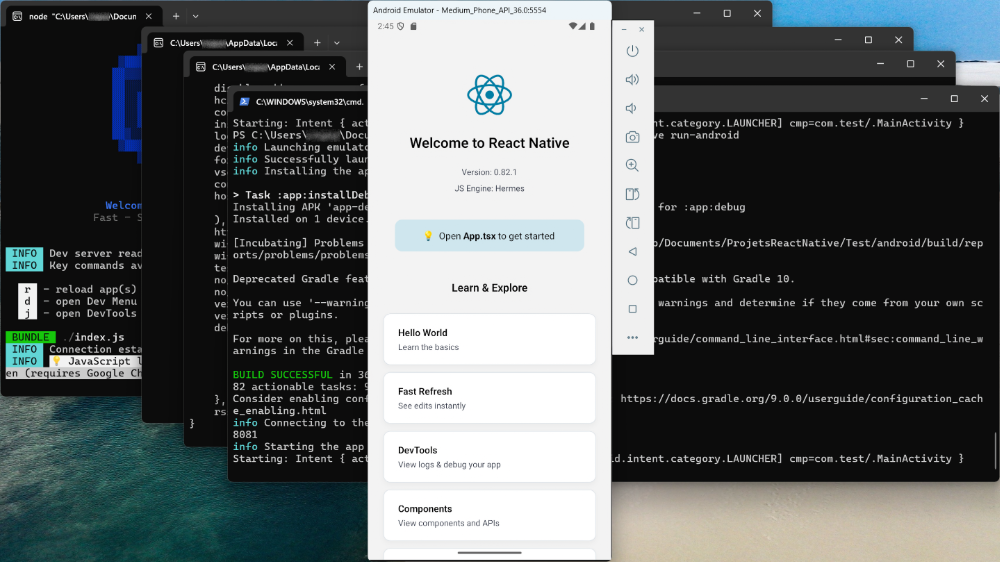

## Quelques solutions aux problèmes rencontrés

En cas de problème, cette commande pourrait vous mettre sur la bonne piste :

Terminal

npx react-native doctor

Parfois, vider le cache de Metro permet de régler des problèmes.

Terminal

npx react-native start --reset-cache

Vous pouvez aussi tenter cette commande :

Terminal

cd MonProjet/android  
./gradlew clean

Pour en savoir plus sur le système et les bibliothèques utilisées par React Native :

Terminal

npx react-native info

Pour redémarrer le serveur adb (Android Debug Bridge), l'outil qui se charge de faire le pont entre l'émulateur et l'ordinateur :

Terminal

adb kill-server  
adb start-server

Les manipulations suivantes sont souvent aidantes :

* refermer l'émulateur
* refermer la fenêtre Metro avec Ctrl + C
* relancer l'application.

Toujours lors du lancement de l'application dans l'émulateur, si vous obtenez une erreur du genre « Syntax error in cmake code when parsing string ... invalid character escape \U », ceci est dû à l'utilisation de l'outil [CMake](https://cmake.org/) sous Windows. Le problèmes est dû aux barres obliques inverses (\) utilisées par Windows, qui ne sont pas supportées par CMake. Ce problème est présent seulement sur certaines versions de React Native, par exemple la version 0.76.

La solution consiste à utiliser une ancienne version d'Android, par exemple la version 0.75.

## Pour plus d'information

« Troubleshooting ». React Native. <https://reactnative.dev/docs/troubleshooting>

## 3.2 Environnement Web pour tester une application React Native

[Expo Snack](https://snack.expo.dev/) est un environnement de développement Web qui permet de développer et de tester des applications React Native directement dans le navigateur.

Un exemple d'utilisation est donné dans ce tutoriel : <https://www.freecodecamp.org/news/react-native-networking-api-requests-using-fetchapi/>

## 3.3 Expo

[Expo](https://expo.dev/) est un cadre d'application qui facilite la création d'applications React Native. Il permet de tester les applications dans son interface Expo GO.

Cet environnement convient pour la grande majorité des applications React Native.

Notez qu'il ne s'agit pas d'un simple environnement de développement. Les applications créées avec Expo auront une structure différentes de celles créées directement avec React Native CLI.

Il faut savoir que certains modules pourraient ne pas être disponibles dans Expo. Aussi, les applications seront plus lourdes que celles déveloopées avec React Native CLI.

## Pour plus d'information

« Expo vs React Native CLI: Key Differences Explained ». Swovo. <https://swovo.com/blog/expo-vs-react-native/>

« Should you use Expo or Bare React Native? ». Medium. <https://medium.com/@andrew.chester/should-you-use-expo-or-bare-react-native-8dd400f4a468>

« Why Choose React Native Expo Over React Native CLI in 2025 ». Dev.to. <https://dev.to/singhvishal802/why-choose-react-native-expo-over-react-native-cli-in-2025-1087>

# 4. Les émulateurs et appareils physiques

## 4.1 Travailler avec les émulateurs

Puisque React Native permet de tester une application à l'aide d'un émulateur installé par Android Studio, il est intéressant de mieux comprendre la mécanique derrière cette fonctionnalité.

Par défaut, quand on lance une application, React Native CLI (Command Line Interface), en collaboration avec ADB (Android Debug Bridge), recherche un émulateur actif.

* S'il n'y en a aucun, il en active un et lance l'application dans cet émulateur.
* S'il y en a un seul, il lance l'application dans cet émulateur.
* S'il y en a plusieurs, tout dépend de votre environnement. Il pourrait, par exemple, être nécessaire de refermer manuellement les émulateurs afin d'en garder un seul actif.

La technique la plus simple pour s'assurer que l'application soit lancée sur l'émulateur désiré consiste à en créer un seul dans Android Studio.

Mais si vous désirez conserver plus d'un émulateur, le fait de connaître les techniques de cette fiche vous permettra de lancer l'application sur l'émulateur de votre choix.

Dans cette fiche :

* [Liste des émulateurs](https://apical.xyz/formations/pageunique/applications_mobiles_avec_react_native20251210101311#liste)
* [Activer un émulateur](https://apical.xyz/formations/pageunique/applications_mobiles_avec_react_native20251210101311#activer)
* [Lister les émulateurs actifs](https://apical.xyz/formations/pageunique/applications_mobiles_avec_react_native20251210101311#actif)
* [Retrouver le nom d'un émulateur à partir de son identifiant](https://apical.xyz/formations/pageunique/applications_mobiles_avec_react_native20251210101311#nom)
* [Lancer l'application dans un émulateur](https://apical.xyz/formations/pageunique/applications_mobiles_avec_react_native20251210101311#lancer)
* [Refermer un émulateur](https://apical.xyz/formations/pageunique/applications_mobiles_avec_react_native20251210101311#refermer)
* [Émulateur hors de l'écran](https://apical.xyz/formations/pageunique/applications_mobiles_avec_react_native20251210101311#ecran)

## Liste des émulateurs

Pour connaître les émulateurs créés avec Android Studio (actifs ou non) :

Terminal

C:\Users\MonNom\AppData\Local\Android\Sdk\emulator\emulator -list-avds

On voit le nom des émulateurs.

Résultat à l'écran

PS C:\Users\MonNom> C:\Users\MonNom\AppData\Local\Android\Sdk\emulator\emulator -list-avds  
Medium\_Phone\_API\_36.0  
Pixel\_9a

Autre technique : chaque émulateur aura un dossier à son nom sous C:\Users\MonNom\.android\avd.

## Activer un émulateur

Pour activer un émulateur en particulier :

Terminal

C:\Users\MonNom\AppData\Local\Android\Sdk\emulator\emulator -avd Pixel\_9a

L'émulateur apparaîtra à l'écran.

## Lister les émulateurs actifs

Cette commande liste les émulateurs actifs en fournissant leur identifiant :

Terminal

adb devices

Dans cet écran, on voit qu'il y a un téléphone physique branché à l'ordinateur (35051jegro08333) de même que deux émulateurs actifs (emulator-5554 et emulator-5556).

Résultat à l'écran

PS C:\Users\MonNom> adb devices  
List of devices attached  
35051jegro08333  device  
emulator-5554    device  
emulator-5556    device

## Retrouver le nom d'un émulateur à partir de son identifiant

Pour vérifier le nom de l'émulateur qui correspond à un identifiant :

Terminal

adb -s emulator-5554 emu avd name

Résultat à l'écran

PS C:\Users\MonNom> adb -s emulator-5554 emu avd name  
Pixel\_9a

 

OK

## Lancer l'application dans un émulateur

Lorsque vous avez activé l'émulateur désiré, vous pouvez lancer l'application dans cet émulateur à l'aide de la commande habituelle à condition qu'il n'y ait qu'un seul émulateur actif.

Terminal

cd /chemin/MonProjet  
npx react-native run-android

Dans le cas où il y a plusieurs émulateurs actifs (et que votre environnement est capable de travailler dans ces conditions – ce qui n'est pas toujours le cas), il est possible de forcer l'utilisation d'un émulateur en particulier :

Terminal

cd /chemin/MonProjet  
npx react-native run-android --device=emulator-5554

## Refermer un émulateur

Il est possible de refermer un émulateur de différentes façons :

* en cliquant sur le X dans le coin supérieur droit de l'émulateur;
* en appuyant sur Ctrl + C dans la fenêtre Terminal qui a lancé l'émulateur;
* à l'aide de la commande suivante, en changeant emulator-5554 pour l'identifiant de l'émulateur :

  Terminal

  adb -s emulator-5554 emu kill

## Émulateur hors de l'écran

Si l'émulateur apparaît partiellement hors de l'écran ou, pire encore, complètement en dehors de l'écran, il est possible de modifier ce comportement à l'aide d'un fichier de configuration.

* Dans l'explorateur de fichiers, rendez-vous dans le dossier C:\Users\MonNom\.android\avd.
* Cliquez sur le dossier qui porte le nom de l'émulateur en problème.
* À l'aide d'un éditeur de texte brut, par exemple Geany, éditez le fichier emulator-user.ini.
* Modifiez les coordonnées pour afficher l'émulateur à l'intérieur de la fenêtre. Dans cet exemple, je le place dans le coin supérieur gauche de l'écran.

  Fichier emulator-user.ini

  window.x = 0  
  window.y = 0  
  ...

## 4.2 Exécuter une application React Native sur un téléphone Android

Il est possible de tester une application React Native sur un téléphone Android plutôt que d'utiliser un émulateur.

* Sur le téléphone, assurez-vous que les options de développeur sont activées : Paramètres (Settings) / À propos du téléphone (About phone) / Cliquer 7 fois sur Numéro de version (Build number).

  ou

  Paramètres (Settings) / Dans la zone de recherche, entrer Options pour les développeurs (Developer options) / Taper sur l'option pour l'activer.
* Activez le débogage USB : Paramètres (Settings) / Dans la zone de recherche, entrer Options pour les développeurs (Developer options) / Activer Débogage USB (USB debugging).
* Brancher le téléphone à l'ordinateur via USB.
* Vérifiez que le téléphone est reconnu en lançant cette commande dans une fenêtre Terminal à partir du dossier de l'application :

  Terminal

  adb devices
* Un seul périphérique doit être actif dans cette commande. Si un émulateur est listé sans la mention offline, il faut absolument le refermer avant de poursuivre.
* Lancez votre application normalement, elle apparaîtra sur le téléphone.

## Pour plus d'information

« Running On Device ». React Native. <https://reactnative.dev/docs/running-on-device?os=windows&platform=android>

# 5. VS Code

## 5.1 Choisir le meilleur IDE

Pour développer une application React Native, Android Studio est requis pour avoir accès à un émulateur. Cependant, il n'est pas le seul environnement de développement à votre disposition.

Voici quelques choix qui s'offrent à vous :

* [apical\_lien\_interne][visual\_studio\_code\_pour\_react\_native,Visual Studio Code][/apical\_lien\_interne]
* [WebStorm](https://www.jetbrains.com/webstorm/)
* Android Studio (évidemment!)
* [Deco IDE](https://www.decoide.org/)

## 5.2 Visual Studio Code pour React Native

Visual Studio Code est un environnement de développement intégré très flexible et adapté à plusieurs langages de programmation.

Il est un joueur de choix pour développer des applications React Native.

Je vous propose quelques pistes pour qu'il soit bien adapté à ce langage.

## Quelques extensions

React Native Tools : <https://microsoft.github.io/vscode-react-native/>

## Quelques raccourcis-clavier

| Raccourci Windows | Rôle | Équivalent Mac |
| --- | --- | --- |
| Ctrl + K, C | Mettre en commentaire (maintenir la touche Ctrl ou Cmd quand vous appuyez sur C) | ⌘ Cmd + K, C |
| Ctrl + K, U | Enlever les marques de commentaire | ⌘ Cmd + K, U |
| Ctrl + Maj + K | Supprimer une ligne | ⌘ Cmd + ⇧ Maj + K |
| Maj + Alt + Flèche bas | Dupliquer une ligne | ⇧ Maj + ⌥ Option + Flèche bas |
| Ctrl + K, F | Refaire l'indentation du code sélectionné (VS Code nous demandera de configurer le formateur par défaut selon le langage de programmation utilisé) | ⌘ Cmd + K, F |
| Maj + Alt + souris | Effectuer une sélection rectangulaire. Le point d'insertion doit être placé au début de la zone à sélectionner avant d'appuyer sur les touches. | ⇧ Maj + ⌥ Option + souris |
| Maj + Ctrl + L | Sélectionner toutes les occurences du mot actuellement sélectionné, créant une sélection multiple | ⇧ Maj + ⌘ Cmd + L |
| Ctrl + D | Sélectionner la prochaine occurence du mot actuellement sélectionné, créant une sélection multiple | ⌘ Cmd + D |

## 5.3 Gérer les importations

Lorsqu'on code en React Native, il y a une foule d'importations à réaliser.

Heureusement, VS Code offre des fonctionnalités pour faciliter ce travail.

## Ajout d'un import manquant

Dès que vous ajoutez un élément non connu, VS Code le souligne en rouge.

Pour ajouter automatiquement le import correspondant :

* Faites pointer la souris sur le mot en rouge OU cliquez sur le mot puis appuyez sur Ctrl + . sous Windows ou ⌘ Cmd+. sous Mac.

  
* Choisissez Mettre à jour l'importation à partir de ....

  

## Retirer les import inutilisés

Inversement, si vous avez fait un import puis avez retiré l'élément qui nécessitait ce import, VS Code peut faire le ménage pour vous.

* Dans la liste des import, faites pointer la souris sur un mot grisé OU cliquez sur le mot puis appuyez sur Ctrl + . sous Windows ou ⌘ Cmd+. sous Mac.

  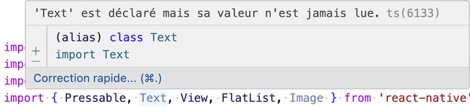
* Sélectionnez Supprimer la déclaration inutilisée pour ... ou Supprimer toutes les importations inutilisées.

  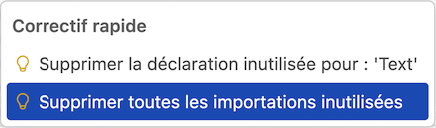

# 6. Initiation à React Native

## 6.1 Structure du projet

Dans le cadre de ce cours, tous les fichiers que vous créerez seront placés dans le dossier src, que vous devez créer à la racine du projet.

Parmi les fichiers que vous coderez, seul le fichier App.tsx demeurera à la racine.

Voici un aperçu de la structure attendue pour le projet. Notez que les fichiers et dossiers d'un projet de base n'ont pas tous été reproduits sur cette image.

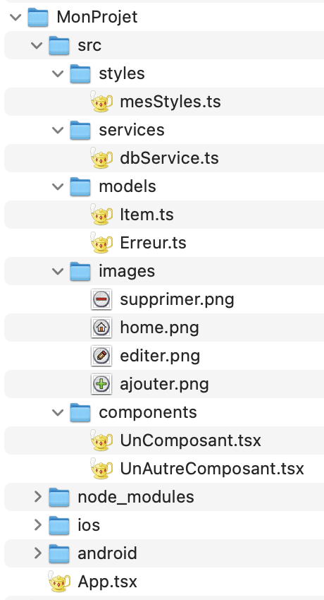

## 6.2 Fichiers initiaux du projet

Une fois que vous avez créé votre projet React Native à l'aide de la commande npx @react-native-community/cli init MonProjet, voici les fichiers initiaux générés.

Vous remarquerez que la structure du dossier android ressemble à celle d'un projet Android natif.

De même, celle du dossier ios ressemble à celle d'un projet iOS natif avec UIKit (on le reconnait au fichier .storyboard). Même si nous connaissons plutôt SwiftUI, nous voyons que iOS saura reconnaître les fichiers de ce projet.

Rassurez-vous, le contenu de ces dossiers n'aura pas à être modifié.

Le point de départ du projet est le fichier App.tsx, avec sa fonction App(). C'est là que vous pourrez débuter les modifications au squelette afin de créer votre propre application.

Tous les autres fichiers que vous coderez seront placés dans un dossier src que vous créerez à la racine du projet.

## 6.3 Fichier de base de l'application (App.tsx)

Le fichier App.tsx est le fichier de base d'une application React Native.

Au départ, on y retrouve ce code.

Fichier App.tsx (React Native)

/\*\*  
 \* Sample React Native App  
 \* https://github.com/facebook/react-native  
 \*  
 \* @format  
 \*/

 

import { NewAppScreen } from '@react-native/new-app-screen';  
import { StatusBar, StyleSheet, useColorScheme, View } from 'react-native';  
import {  
  SafeAreaProvider,  
  useSafeAreaInsets,  
} from 'react-native-safe-area-context';

 

function App() {  
  const isDarkMode = useColorScheme() === 'dark';

 

  return (  
    <SafeAreaProvider>  
      <StatusBar barStyle={isDarkMode ? 'light-content' : 'dark-content'} />  
      <AppContent />  
    </SafeAreaProvider>  
  );  
}

 

function AppContent() {  
  const safeAreaInsets = useSafeAreaInsets();

 

  return (  
    <View style={styles.container}>  
      <NewAppScreen  
        templateFileName="App.tsx"  
        safeAreaInsets={safeAreaInsets}  
      />  
    </View>  
  );  
}

 

const styles = StyleSheet.create({  
  container: {  
    flex: 1,  
  },  
});

 

export default App;

La moindre modification à ce code sera immédiatement reflétée dans l'émulateur une fois l'application lancée.

Tout ce code peut être effacé.

On y codera plutôt une fonction App() déclarée à l'aide de la [apical\_lien\_interne][comment\_fonctionnent\_les\_fonctions\_flechees,syntaxe des fonctions fléchées][/apical\_lien\_interne].

Dans le return de cette fonction, on ajoutera des composants à l'aide de code [JSX](https://react.dev/learn/writing-markup-with-jsx) afin de préciser ce qui sera affiché.

Fichier App.tsx (React Native)

import React from 'react';

 

const App = () => {  
  return (  
      ...  
  );  
};

 

export default App;

Si vous préférez, il est possible déclarer un composant fonctionnel.

Remarquez qu'ici, j'ai précisé que le type de retour est JSX.Element, c'est-à-dire un composant React Native.

Fichier App.tsx (React Native)

import React from 'react';  
import type {JSX} from 'react';

 

function App(): JSX.Element {  
  return (  
      ...  
  );  
};

 

export default App;

## 6.4  Les composants de React Native

Plusieurs composants sont fournis directement par React Native sans nécessiter d'installation supplémentaire.

Ces composants React Native jouent un rôle qui ressemble à celui des balises HTML en React : ils constituent les blocs de base à partir desquels d'autres composants seront développés pour former l'interface de l'application.

Pour les utiliser, vous devez ajouter l'instruction import { View, Text } from 'react-native'; en prenant soin de lister les composant utilisés.

Dans la littérature, on retrouve deux appellations :

* [Composants de base (basic components)](https://apical.xyz/formations/pageunique/applications_mobiles_avec_react_native20251210101311#basic)
* [Composants du noyau (core components)](https://apical.xyz/formations/pageunique/applications_mobiles_avec_react_native20251210101311#core)

## Composants de base (basic components)

La documentation officielle de React Native mentionne qu'il y a des basic components[1](https://reactnative.dev/docs/components-and-apis#basic-components).

Les composants de base sont les composants de plus bas niveau, par exemple :

* <[apical\_lien\_interne][view,View][/apical\_lien\_interne]>
* <[apical\_lien\_interne][text\_003,Text][/apical\_lien\_interne]>
* <[apical\_lien\_interne][image\_003,Image][/apical\_lien\_interne]>
* <ScrollView>
* <TextInput>
* <[apical\_lien\_interne][pressable,Pressable][/apical\_lien\_interne]>

Voici un exemple d'utilisation de composants de base.

React Native

<View>  
  <Image  
    source={{  
      uri: 'https://apical.xyz/Sourire.png',  
    }}  
    style={mesStyles.imageAccueil}  
  />  
  <Text>Bonjour!</Text>  
 </View>

## Composants du noyau (core components)

Les composants du noyau regroupent l'ensemble des composants fournis par React Native. Ils incluent les composants de base.

Parmi eux, on retrouve également d'autres composants de plus haut niveau, par exemple :

* <[apical\_lien\_interne][button\_003,Button][/apical\_lien\_interne]>
* <[apical\_lien\_interne][flatlist,FlatList][/apical\_lien\_interne]>
* <[apical\_lien\_interne][alert\_002,Alert][/apical\_lien\_interne]>
* <StatusBar>

Pour une liste plus complète : <https://reactnative.dev/docs/components-and-apis>.

## Source

1. « Core Components and APIs - Basic Components ». React Native. <https://reactnative.dev/docs/components-and-apis#basic-components>

## Pour plus d'information

« Fundamental React Native Components You Need To Know About ». Locofy Blog. <https://www.locofy.ai/blog/react-native-components>

« React Native cheatsheet for beginners ». Medium. <https://medium.com/coinmonks/react-native-cheatsheet-for-beginners-ce0559365d68>

## 6.5 Développer nos propres composants

Le composant est l'unité de base d'une vue React Native.

Il existe des [apical\_lien\_interne][composants\_de\_base,composants de base][/apical\_lien\_interne] fournis par React Native. Nous allons développer nos propres composants à partir de ces composants de base.

Il est d'usage de placer chaque composant dans son propre fichier.

Je vous présente deux syntaxes possibles. Les deux syntaxes offrent chacune quelques particularités mais dans l'ensemble, elles sont équivalentes.

Remarquez que dans le return, il n'est pas possible de retourner plus d'un composant. Il est possible de retourner un composant qui en englobe d'autres, ou encore d'entourer plusieurs composants par [apical\_lien\_interne][les\_fragments,des fragments][/apical\_lien\_interne] (<> ... </>).

Nous prendrons l'habitude de placer tous les composants dans le dossier MonProjet/src/components. Vous devez créer le dossier src et son sous-dossier.

Parmi les fichiers que vous aurez modifiés dans votre projet, seul App.tsx demeurera à la racine.

## Syntaxe des fonctions fléchées

Ce premier exemple utilise la [apical\_lien\_interne][comment\_fonctionnent\_les\_fonctions\_flechees,syntaxe des fonctions fléchées][/apical\_lien\_interne].

C'est cette syntaxe qui sera utilisée partout dans les notes de cours.

Fichier MonComposantFleche.tsx (React Native)

import React from 'react';  
import {Text} from 'react-native';  
  
const MonComposantFleche = () => {  
  return (  
    <>  
      <Text>Je suis un composant déclaré avec une fonction fléchée.</Text>  
      ...  
    </>  
  );  
};  
  
export default MonComposantFleche;

## Syntaxe des fonctions

Il est également possible d'utiliser la syntaxe des fonctions. On dira qu'on a un composant fonctionnel.

Fichier MonComposantFonction.tsx (React Native)

import React from 'react';  
import type {JSX} from 'react';  
import {Text} from 'react-native';  
  
function MonComposantFonction(): JSX.Element {  
  return (  
    <>  
      <Text>Je suis un composant déclaré avec une fonction.</Text>  
      ...  
    </>  
  );  
}  
  
export default MonComposantFonction;

## Composants de classe

Il existe une troisième syntaxe qui consite à créer une classe qui hérite de Component. On dira qu'on a un composant de classe.

Cependant, cette syntaxe n'est plus recommandée par l'équipe de React[1](https://react.dev/reference/react/Component) :

> We recommend defining components as functions instead of classes.

React Native

class MonComposantClasse extends Component {  
  constructor(props) {  
    super(props);  
  }

 

  render() {  
    return (  
      <>  
        <Text>Je suis un composant déclaré en tant que classe.</Text>  
        ...  
      </>  
    );  
  }  
}

 

export default MonComposantClasse;

## Utiliser un composant

Dans un cas comme dans l'autre, pour utiliser ce composant, vous pouvez utiliser ceci, par exemple dans le fichier App.tsx.

Fichier App.tsx (React Native)

import React from 'react';  
import {View} from 'react-native';  
import MonComposantFleche from './src/components/MonComposantFleche';  
import MonComposantFonction from './src/components/MonComposantFonction';  
  
const App = () => {  
  return (  
    <View>  
      <MonComposantFleche />  
      <MonComposantFonction />  
    </View>  
  );  
};  
  
export default App;

## Source

1. « Component ». React. <https://react.dev/reference/react/Component>

## Pour plus d'information

« React Fundamentals ». React Native. <https://reactnative.dev/docs/intro-react>

« Comparing different types of functions used in react-native ». Medium. <https://mithusha-s.medium.com/comparing-different-types-of-functions-used-in-react-native-f1f988c838bc>

« React functional components: const vs. function ». dev.to. <https://dev.to/ugglr/react-functional-components-const-vs-function-2kj9>

« React.ReactNode vs JSX.Element vs React.ReactElement ». Total Typescript. <https://www.totaltypescript.com/jsx-element-vs-react-reactnode>

« Const vs. Function For React Functional Components ». Plain English. <https://plainenglish.io/blog/const-vs-function-for-react-functional-components>

« Is There Any Reason to Still Use React Class Components? ». Medium. <https://medium.com/geekculture/is-there-any-reason-to-still-use-react-class-components-9b6a1e6aa9ef>

## 6.6 Simples accolades ou doubles accolades?

Parfois, le code React Native comprend des accolades. Ceci signifie qu'il faut évaluer du code JavaScript.

JavaScript

<Text>{props.nom}</Text>

Dans d'autres cas, on retrouve des doubles-accolades.

* Les accolades extérieures indiquent qu'il faut évaluer du code JavaScript.
* Les accolades intérieures représentent un objet JavaScript. On le reconnaît à ses paires propriété: valeur.

React Native

<Image source={{ uri: 'https://apical.xyz/medias/fr/LogoApical.png' }} ... />

## 6.7 Les fragments (<>...</> ou <React.Fragment>...</React.Fragment>)

Dans certains blocs React Native, il n'est pas possible d'avoir plus d'un composant.

C'est le cas notamment dans le return d'un composant.

Le code qui suit ne compilera pas et il générera l'erreur « Les expressions JSX doivent avoir un élément parent. ».

React Native

return (  
  <Text>{ami.prenom}</Text>  
  <Text>{ami.nomFamille}</Text>  
 );

Pour régler ce problème, on peut entourer les composants dans un autre composant plus englobant.

React Native

return (  
  <View>  
    <Text>{ami.prenom}</Text>  
    <Text>{ami.nomFamille}</Text>  
  </View>  
 );

Il est aussi possible de l'entourer de [fragments](https://react.dev/reference/react/Fragment), c'est-à-dire des balises qui permettent de grouper des composants sans ajouter de composant et sans impact visuel.

Dans leur forme la plus simple, les fragments sont représentés par les symboles <> et </>.

React Native

return (  
  <>  
    <Text>{ami.prenom}</Text>  
    <Text>{ami.nomFamille}</Text>  
  </>  
);

On obtiendra le même résultata avec ceci :

React Native

return (  
  <React.Fragment>  
    <Text>{ami.prenom}</Text>  
    <Text>{ami.nomFamille}</Text>  
  </React.Fragment>  
);

Cette dernière syntaxe permet d'ajouter des propriétés au fragment, par exemple la clé unique (attribut key) pour chaque itération.

React Native

{amis.map((ami) => (  
  <React.Fragment key={ami.id}>  
    <Text>{ami.prenom}</Text>  
    <Text>{ami.nomFamille}</Text>  
  </React.Fragment>  
))}

## 6.8 Ajouter des styles

Les styles dans React Native ressemblent beaucoup aux règles CSS en Web.

Les bonnes pratiques veulent que les styles soient déclarés dans des fichiers distincts et importés dans le fichier du composant.

Contrairement aux classes CSS, qui utilisent généralement la [apical\_lien\_interne][casse\_kebab\_la-casse-kebab,casse kebab][/apical\_lien\_interne] (tout en minuscules et traits d'union entre les mots), le nom d'un style React Native sera écrit en [apical\_lien\_interne][Casse\_chameau\_laCasseChameau,casse chameau][/apical\_lien\_interne] (débute par minuscule et majuscule à chaque changement de mot).

Nous prendrons l'habitude de placer tous les fichiers de styles dans le dossier MonProjet/src/styles.

Remarquez que le fichier de style portera l'extension .ts (TypeScript) et non .tsx (TypeScript qui contient du JSX).

Le nom du fichier utilisera la casse chameau donc il débutera par une minuscule puisque les fichiers dont le nom débute par une majuscule sont généralement des composants.

Fichier mesStyles.ts (React Native)

import {StyleSheet} from 'react-native';  
  
const mesStyles = StyleSheet.create({  
  conteneur: {  
    alignItems: 'center',  
  },  
  imageAccueil: {  
    width: 200,  
    height: 200,  
  },  
});  
  
export {mesStyles};

Fichier MonComposant.tsx

import React from 'react';  
import {View, Image, Text} from 'react-native';  
import { mesStyles } from '../styles/mesStyles';

 

const MonComposant = () => {  
  return (  
    <View style={mesStyles.conteneur}>  
      <Image  
        source = {{  
          uri: 'https://apical.xyz/logoApical.png',  
        }}  
        style={mesStyles.imageAccueil}  
      />  
    </View>  
  );  
};  
  
export default MonComposant;

## Affecter plusieurs classes CSS à un composant

Dans le cas où un composant doit être affecté par plus d'une classe CSS, il faut placer les classes CSS dans un tableau.

React Native

<View style={[mesStyles.conteneur, mesStyles.accueil]}>  
  ...  
</View>

## Pour plus d'information

« Style ». React Native. <https://reactnative.dev/docs/style>

« React Native Styling: Structure for Style Organization  ». Thoughtbot. <https://thoughtbot.com/blog/structure-for-styling-in-react-native>

## 6.9 Propriétés

Les propriétés, appelées props, sont des valeurs de base que l'on peut passer à un composant. Elles sont immuables, c'est-à-dire que leur valeur ne peut pas être modifiée.

Pour recevoir et utiliser une propriété, le composant utilise cette syntaxe :

React Native

type MonComposantProps = {  
  texte: string;  
};  
  
const MonComposant = (props: MonComposantProps) => {  
  return (  
    <>  
      <Text>{props.texte}</Text>  
      ...  
    </>  
  );  
};

Plutôt que d'utiliser le mot-clé type pour définir les propriétés, il est possible d'utiliser interface. Bien qu'il existe [quelques différences fonctionnelles](https://blog.logrocket.com/types-vs-interfaces-typescript/) entre ces deux syntaxes, elles peuvent toutes deux être utilisées dans le présent contexte.

React Native

interface MonComposantProps {  
  texte: string;  
}

## Utilisation

Pour fournir une valeur aux propriétés, la syntaxe ressemble à celle des attributs HTML.

JavaScript

const App = () => {  
  return (  
    <MonComposant texte="Ça marche!" />  
  );  
};

## Propriétés par défaut

Il est possible de définir une valeur par défaut pour les propriétés.

De cette façon, si aucune valeur n'est fournie lors de l'utilisation du composant, c'est la valeur par défaut qui sera utilisée.

React Native

type MonComposantProps = {  
  texte: string;  
};

 

 

 

const defaultProps: MonComposantProps = {  
  texte: 'À venir...',  
};  
  
const MonComposant = (props: MonComposantProps) => {  
  return (  
    <>  
      <Text>{props.texte}</Text>  
      ...  
    </>  
  );  
};  
  
MonComposant.defaultProps = defaultProps;

## Pour plus d'information

« Props ». React Native. <https://reactnative.dev/docs/props>

« Mastering TypeScript: A Guide to Choosing Between ‘type’ and ‘interface’ ». Medium. <https://levelup.gitconnected.com/mastering-typescript-a-guide-to-choosing-between-type-and-interface-c31d3527693b>

## 6.10 Variables d'état (useState)

Les variables d'état React Native, appelées states, permettent de rafraîchir l'écran dès que leur valeur change.

React Native

import React, {useState} from 'react';  
import {Text, Button} from 'react-native';  
  
const MonComposant = () => {  
  const [uneValeur, setUneValeur] = useState('Valeur initiale');  
  
  return (  
    <>  
      <Text>{uneValeur}</Text>  
      <Button  
        onPress={() => {  
          setUneValeur('Nouvelle valeur!');  
        }}  
        title="Changer la valeur"  
      />  
    </>  
  );  
};

## Variable d'état qui peut être nulle

Pour indiquer à TypeScript qu'une variable d'état peut être nulle, on précisera son type comme suit :

React Native

const [nombre, setNombre] = useState<number | null>(0);

## Variable d'état initialisée à partir d'une propriété

Parfois, un composant recevra une valeur dans une propriété dans le but de modifier cette valeur.

On pourra à ce moment modifier une variable d'état à partir de cette propriété :

React Native

const [texte, setTexte] = useState(props.texteOriginal);

## La fonction de modification d'état est asynchrone

Attention : il ne faut jamais utiliser une variable d'état immédiatement après avoir modifié sa valeur car cette opération est asynchrone.

On peut contourner ce problème en travaillant avec une variable locale.

Plutôt que de faire ceci :

React Native

setQuantite(...);  
  
// ici, on n'a aucune garantie que la variable est changée  
if (quantite == 3) {  
  ...  
}

il faut faire :

React Native

const quantiteLocale = ...  
  
setQuantite(quantiteLocale);  
  
if (quantiteLocale == 3) {  
  ...  
}

Une autre technique consiste à utiliser un [apical\_lien\_interne][reagir\_seulement\_lorsqu\_une\_variable\_d\_etat\_a\_change\_de\_valeur,useEffect][/apical\_lien\_interne] qui prendra effet quand cette variable d'état aura effectivement changé de valeur.

React Native

const MonComposant = () => {  
  ...

 

  useEffect(() => {  
    if (quantite == 3) {  
      ...  
    }  
  }, [quantite]);

 

  return (  
    <>  
      ...  
      <Button  
        onPress={() => {  
          setQuantite(...);  
        }}  
        title="Incrémenter"  
      />  
    </>  
  );  
};

## Pour plus d'information

« Sharing State Between Components ». React. <https://react.dev/learn/sharing-state-between-components>

# 7. Les composants du noyau (core components)

## 7.1 <View>

Le composant [<View>](https://reactnative.dev/docs/view) est un conteneur qui permet notamment de spécifier une mise en forme.

Ce composant a un fonctionnement semblable à celui de la balise 
 en HTML.

React Native

import React from 'react';

 

const App = () => {  
  return (  
    <View style={mesStyles.conteneur}>  
      ...  
    </View>  
  );  
};

 

export default App;

## 7.2 <Text>

Le composant [<Text>](https://reactnative.dev/docs/text) permet d'afficher un simple texte à l'écran.

React Native

<Text>Bonjour!</Text>

Pour forcer un saut de ligne :

React Native

<Text>Bonjour{'\n'}tout le monde!</Text>

Pour afficher une variable :

React Native

<Text>{maVariable}</Text>

Il est possible de lui ajouter [apical\_lien\_interne][ajouter\_des\_styles,des styles][/apical\_lien\_interne].

React Native

<Text style={styles.titre}>Mon titre</Text>

## 7.3 <Image>

Le composant [<Image>](http://reactnative.dev/docs/image) permet d'afficher une image locale ou encore une image à partir d'un URL.

Attention : contrairement à SwiftUI et à Jetpack Compose, il n'y a pas d'icônes en React Native. Pour faire l'équivalent, on travaillera avec de petites images.

React Native

<Image source={require('../images/home.png')} />

Dans le cas d'une image chargée à partir d'un URL, il faut absolument spécifier sa taille [apical\_lien\_interne][ajouter\_des\_styles,à l'aide d'un style][/apical\_lien\_interne] puisque React Native n'est pas en mesure de connaître sa taille avant que le téléchargement soit complété.

React Native

<Image source={{ uri: 'https://apical.xyz/medias/fr/LogoApical.png' }} style={styles.logo} />

## Pour plus d'information

« Image Style Props ». React Native. <https://reactnative.dev/docs/image-style-props>

## 7.4 <Button>

Dans React Native, le composant [<Button>](https://reactnative.dev/docs/button), comme son nom l'indique, permet de créer un bouton cliquable.

Il a l'avantage d'ajuster l'apparence selon la plateforme cible : Android ou iOS. De plus, il est très simple à utiliser.

Par contre, il n'est pas possible de modifier son apparence sauf pour modifier sa couleur.

React Native

<Button  
  onPress={...}  
  title="Je suis un Button"  
  color="#2acfcaff"  
 />

Voici l'apparence du bouton sur chacune des plateformes.

|  |  |  |
| --- | --- | --- |
| Button sur Android |  | Button sur iOS |
| Androïd |  | iOS |

Si vous désirez créer un bouton avec une apparence personnalisée, vous devez vous tourner vers d'autres composants, par exemple <[apical\_lien\_interne][pressable,Pressable][/apical\_lien\_interne]>.

React Native

<Pressable  
  style={mesStyles.bouton}  
  onPress={...}>  
  <Text style={mesStyles.texteBouton} adjustsFontSizeToFit>Cliquez ici</Text>  
 </Pressable>

Il existe également le composant <TouchableOpacity> mais React Native suggère que ce composant pourrait disparaître[1](https://reactnative.dev/docs/touchableopacity).

> If you're looking for a more extensive and future-proof way to handle touch-based input, check out the Pressable API.

## Source

1. «  TouchableOpacity ». React Native. <https://reactnative.dev/docs/touchableopacity>

## Pour plus d'information

« Buttons on React Native: Understanding the difference and which one to use ». Medium. <https://gabrielvrl.medium.com/buttons-on-react-native-understanding-the-difference-and-which-one-to-use-756760140119>

## 7.5 <Pressable>

Le composant [<Pressable>](https://reactnative.dev/docs/pressable) permet de réagir à un clic sur n'importe quoi à l'écran.

Ici, on réagit à un clic sur du texte :

React Native

<Pressable  
  style={mesStyles.bouton}  
  onPress={...}>  
  <Text style={mesStyles.texteBouton} adjustsFontSizeToFit>Cliquez ici</Text>  
 </Pressable>

Ici, on réagit à un clic sur une image :

React Native

<Pressable onPress={...}>  
  <Image source={require('../images/home.png')} style={mesStyles.icone} />  
 </Pressable>

## Effet sur le clic

Fait intéressant : il est possible de modifier le style au moment du clic pour améliorer l'expérience utilisateur.

React Native

<Pressable  
  onPress={...}  
  style={({ pressed }) => [  
    mesStyles.boutonBase,  
    pressed && mesStyles.boutonPresse  
  ]}  
 >

Les classes CSS pourraient ressembler à ceci. Le bouton sera plus foncé au moment de cliquer dessus.

Fichier mesStyles.ts (React Native)

boutonBase: {  
  paddingVertical: 10,  
  paddingHorizontal: 20,  
  borderRadius: 8,  
  backgroundColor: 'rgb(23, 72, 128)',  
 },  
 boutonPresse: {  
  backgroundColor: 'rgb(11, 45, 80)',  
 },

Il peut également être intéressant de jouer avec l'opacité.

Fichier mesStyles.ts (React Native)

boutonPresse: {  
  opacity: 0.2,  
 },

## 7.6 <FlatList>

Le composant [<FlatList>](https://reactnative.dev/docs/flatlist.html) est intéressant pour afficher une liste d'items en colonne ou en quadrillé.

Pour lister des données dont le type comprend un identifiant :

React Native

<FlatList  
  contentContainerStyle={styles.listedonnees}  
  numColumns={1}  
  data={donnees}  
  renderItem={({item}) => <Text>{item.nom}</Text>}  
/>

Si les données ne possèdent pas d'identifiant :

React Native

<FlatList  
  contentContainerStyle={styles.listedonnees}  
  numColumns={1}  
  data={donnees}  
  keyExtractor={(item, i) => String(i)}  
  renderItem={({item}) => <Text>{item.nom}</Text>}  
/>

Si on a besoin de connaître l'index de chaque item :

React Native

<FlatList  
  contentContainerStyle={styles.listedonnees}  
  numColumns={1}  
  data={donnees}  
  renderItem={({item, index}) => <Text>{index}: {item.nom}</Text>}  
/>

## 7.7 <Alert>

Avec React Native, [Alert](https://reactnative.dev/docs/alert) permet d'afficher un popup qui permet par exemple d'afficher un message ou de demander une confirmation.

React Native

const confirmerSuppression = (description: string) => {  
  Alert.alert('Confirmation', `Désirez-vous vraiment supprimer l'item ${description}?`, [  
    {  
      text: 'Non',  
      style: 'cancel',  
    },  
    {  
      text: 'Oui',  
      onPress: () => {  
       // procéder à la suppression  
      }  
    },  
  ]);  
 };  
return (  
  ...  
  <Button  
    title="Supprimer"  
    onPress={() => {  
      confirmerSuppression(...)  
    }}  
  />  
  ...  
);

# 8. Rendu conditionnel

## 8.1 Afficher un élément React Native seulement si une condition est remplie (&&)

L'opérateur && (ET logique) peut être utilisé pour effectuer un affichage seulement si une condition est vraie.

Le prinicipe est le suivant : avec un ET logique, si la première condition est fausse, il est inutile de tenter d'évaluer ce qui suit car le résultat sera forcément faux.

Donc, l'affichage qui suit le ET ne sera pas réalisé si la condition est fausse.

React Native

{uneVariable &&  
  <Text>Ceci est affiché seulement si uneVariable est à true.</Text>  
}

## 8.2 Afficher une chose ou une autre selon une condition

L'opérateur ternaire peut être utilisé pour afficher une chose ou une autre selon une condition.

Attention : contrairement à l'affichage conditionnel avec un ET logique qui nécessite deux caractères &, il n'y a qu'un seul caractère ? ici.

React Native

{uneVariable ?  
  <Text>La condition est remplie.</Text>  
:  
  <Text>La condition n'est pas remplie.</Text>  
}

# 9. Déboguer une application React Native

## 9.1 Menu Dev de l'émulateur

Pour ouvrir le menu Dev de l'émulateur :

* Dans la fenêtre Metro, appuyez sur d

  

  ou
* Dans la fenêtre de l'émulateur, appuyez sur Ctrl + M sous Windows ou Cmd ⌘ + M sous macOS.

Un menu apparaîtra directement dans l'émulateur et vous offrira différentes options utiles.

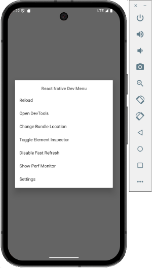

## 9.2 Les outils de développement (DevTools)

Pour ouvrir les outils de développement de React Native :

* Dans la fenêtre Metro, appuyez sur j

  

  ou
* Dans la fenêtre de l'émulateur, appuyez sur Ctrl + M sous Windows ou Cmd ⌘ + M sous macOS puis sélectionnez Open DevTools.

Une fois ce menu ouvert, vous avez accès à des outils de débogage qui ressemblent à ceux de Google Chrome.

Vous pouvez :

* Cliquer sur l'onglet Console pour accéder à une console qui permet de voir des messages et d'évaluer des expressions
* Cliquer sur l'onglet Sources pour voir le code JavaScript, interroger des variables et mettre des points d'arrêt
* Cliquer sur l'onglet Components pour questionner l'état d'un composant
* etc.

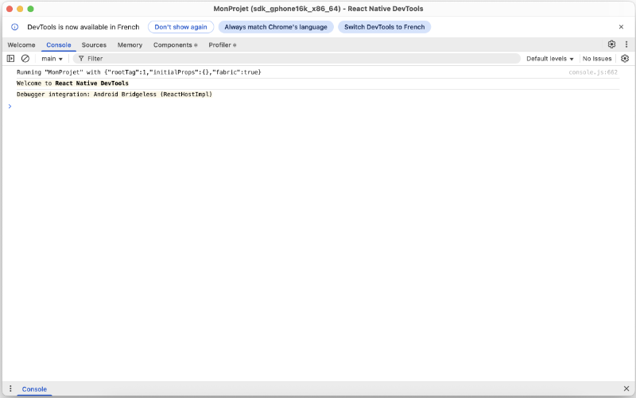

## Pour plus d'information

« Debugging Basics ». React Native. <https://reactnative.dev/docs/debugging>

« React Native DevTools ». React Native. <https://reactnative.dev/docs/react-native-devtools>

## 9.3 console.log()

Dans une application React Native, il est possible d'utiliser console.log() pour afficher un message et ainsi faciliter le débogage.

Par exemple, pour afficher la valeur de la variable maVariable, vous pouvez utiliser cette commande :

React Native

console.log(`maVariable: ${maVariable}`);

Le résultat apparaîtra dans [apical\_lien\_interne][les\_outils\_de\_developpement\_devtools,la fenêtre DevTools][/apical\_lien\_interne], onglet Console.

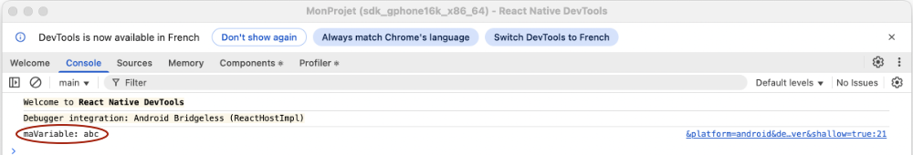

Notez qu'auparavant, ils apparaissaient dans le Terminal de Metro mais ce comportement a changé depuis l'arrivée de [React Native 0.77](https://reactnative.dev/blog/2025/01/21/version-0.77) en janvier 2025.

## 9.4 Ajouter un point d'arrêt dans React ou React Native

Les points d'arrêt sont un outil indispensable lorsqu'on débogue une application.

Je vous montre ici comment ajouter un point d'arrêt pour déboguer du code React et du code React Native à l'aide de différentes techniques :

* [Dans les outils de développement](https://apical.xyz/formations/pageunique/applications_mobiles_avec_react_native20251210101311#outilsdeveloppement)
* [Par programmation (commande debugger)](https://apical.xyz/formations/pageunique/applications_mobiles_avec_react_native20251210101311#debugger)

## Dans les outils de développement

Pour placer un point d'arrêt à partir des outils de développement :

* dans un projet React, utiliser les outils de développement du navigateur. Par exemple, lorsque le code est exécuté dans Chrome : clic droit / Inspecter;
* dans un projet React Native, appuyer sur j dans la fenêtre Metro.

Dans les deux cas, l'onglet Sources donne accès au code source en cours d'exécution. Un clic sur une ligne ajoutera un point d'arrêt.

Voici un exemple en React.

Et voici un exemple en React Native.

Notez que dans la fenêtre Metro, il est possible d'appuyer sur la touche r pour lancer l'application à nouveau.

Ceci est souvent utile pour exécuter à nouveau du code rencontré seulement lors du lancement de l'application.

## Par programmation (commande debugger)

Il est également possible d'ajouter un point d'arrêt par programmation en ajoutant la commande [debugger](https://dev.to/colocodes/how-to-debug-a-react-app-51l4#using-the-raw-debugger-endraw-statement) dans le code à l'endroit où l'on veut que le débogueur s'arrête.

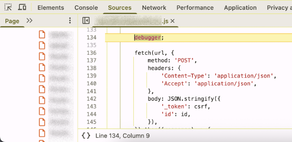

En React comme en React Native, le point d'arrêt ne sera pris en compte que s'il est rencontré alors que les outils de développement sont ouverts.

# 10. Les hooks

## 10.1 Qu'est-ce qu'un hook React Native?

Dans React et React Native, les hooks sont un mécanisme qui permet de suivre l'état d'un composant de type fonction (functional component).

Parmi les hooks les plus utilisés, notons :

* [apical\_lien\_interne][variables\_d\_etat,useState][/apical\_lien\_interne]: permet de définir une variable d'état
* [apical\_lien\_interne][rendre\_une\_variable\_d\_etat\_disponible\_a\_tous\_les\_enfants,useContext][/apical\_lien\_interne]: permet de définir une variable partagée entre différents composants
* [apical\_lien\_interne][reagir\_seulement\_lorsqu\_une\_variable\_d\_etat\_a\_change\_de\_valeur,useEffect][/apical\_lien\_interne]: permet de réagir à un changement de valeur
* [useRef](https://react.dev/reference/react/useRef) : permet de définir une variable qui n'est pas utilisée dans le rendu
* [apical\_lien\_interne][memoriser\_des\_informations\_longues\_a\_calculer\_usememo,useMemo][/apical\_lien\_interne]: permet de mémoriser des informations longues à calculer.
* [apical\_lien\_interne][optimiser\_les\_performances\_usecallback,useCallback][/apical\_lien\_interne]: permet de mettre une fonction en cache entre deux rendus
* [apical\_lien\_interne][effectuer\_une\_action\_quand\_un\_composant\_gagne\_le\_focus,useFocusEffect][/apical\_lien\_interne]: permet d'effectuer du code lorsqu'un écran prend le focus (fonctionne avec React Navigation)

## Pour plus d'information

« Built-in React Hooks ». React. <https://react.dev/reference/react/hooks>

« React Hooks cheat sheet: Best practices with examples ». LogRocket. <https://blog.logrocket.com/react-hooks-cheat-sheet-solutions-common-problems/>

## 10.2 Effectuer un traitement lors du chargement du composant (useEffect sans dépendances)

Le hook [useEffect](https://react.dev/reference/react/useEffect) permet d'effectuer un traitement lorsqu'une variable change de valeur.

Mais si on ne fournit aucune variable en paramètre, le traitement n'aura lieu qu'une seule fois, lorsque le composant vient de se charger.

React Native

const MonComposant = () => {  
  ...  
  
  useEffect(() => {  
    ...   // ce code sera exécuté une fois, lorsque le composant sera chargé  
  }, []);  
  
  return (  
    ...  
  );  
};

## 10.3 Réagir seulement lorsqu'une variable d'état a changé de valeur (useEffect)

Le hook [useEffect](https://react.dev/reference/react/useEffect) permet d'effectuer un traitement seulement lorsqu'une variable change de valeur.

React Native

useEffect(() => {  
  ...   // Ce code sera effectué seulement lorsque maVariable change de valeur.  
}, [maVariable]);

Il sera utile notamment pour effectuer un traitement qui requiert que le changement de valeur soit effectivement fait.

React Native

setMaVariable('nouvelle valeur');   // la nouvelle valeur ne sera effective que lors du prochain rendu  
...  
useEffect(() => {  
  ...   // Ici, on sait que le changement de valeur a eu lieu.  
}, [maVariable]);

## 10.4 Appeler une fonction asynchrone dans un useEffect

Si vous utilisez le hook useEffect pour appeler une fonction asynchrone lorsqu'une variable change de valeur, vous obtiendrez l'erreur « Les expressions 'await' sont autorisées uniquement dans les fonctions asynchrones et aux niveaux supérieurs des modules. ».

React Native

useEffect(() => {  
  const db = await getDBConnection();  
  ...  
}, [id]);

Une des techniques pour régler ce problème consiste à définir une fonction asynchrone dans le useEffect et immédiatement appeler cette fonction.

React Native

useEffect(() => {  
  // pour appeler une fonction asynchrone dans un useEffect, il faut déclarer une fonction async qui fait le await puis appeler cette fonction.  
  // autres pistes de solutions : https://stackoverflow.com/questions/53332321/react-hook-warnings-for-async-function-in-useeffect-useeffect-function-must-ret  
  async function retrouverItem() {  
    ...  
    const db = await getDBConnection();  
    ...

 

  }

 

  retrouverItem();  
 }, [id]);

Je vous propose une autre syntaxe que vous pourriez rencontrer mais qui est moins facile à comprendre pour un débutant.

Il s'agit de déclarer une fonction anonyme et de l'appeler immédiatement grâce aux [fonctions immédiatement invoquées](https://developer.mozilla.org/en-US/docs/Glossary/IIFE) (IIFE, Immediately Invoked Function Expression).

Notez que cet acronyme se prononce « iffy ».

Dans le contexte actuel, la IIFE est asynchrone mais il est possible d'avoir une IIFE sans le mot-clé async.

React Native

useEffect(() => {  
  (async () => {  
    ...  
  })();   // ces parenthèses sont ce qui fait que la fonction est immédiatement invoquée  
 }, [id]);

## 10.5 Rendre une variable d'état disponible à tous les enfants (useContext)

Le hook [useContext](https://react.dev/reference/react/useContext) permet de définir une variable qui sera disponible pour tous les enfants.

Pour l'utiliser avec TypeScript, il faut d'abord définir le type d'information qu'il permet de passer. De façon générale, il s'agira d'une variable d'état et de la fonction qui permet de la modifier.

Ce type peut être défini dans le même fichier que la définition d'une interface.

Fichier src/models/Categorie.ts

export interface Categorie {  
  id: number | null;  
  description: string;  
}

 

export type CategorieContextType = {  
  categories: Categorie[];  
  setCategories: (categories: Categorie[]) => void;  
};

La définition du contexte sera effectuée dans le composant le plus proche parent de ceux qui en ont besoin.

Dans cet exemple, j'ai utilisé le composant de base de l'application.

Fichier App.tsx (React Native)

...  
import {Categorie,CategorieContextType} from "./models/Categorie";  
  
export const CategoriesContext = React.createContext<CategorieContextType | null>(null);  
  
const App = () => {  
  const [categories, setCategories] = useState<Categorie[]>([]);  
  ...  
  return (  
    <CategoriesContext.Provider value={{categories, setCategories}}>  
      {/\* Les composant qui sont ici auront accès au contexte \*/}  
    </CategoriesContext.Provider>  
  );  
};

Dans un composant enfant, on retrouvera le contexte comme suit :

Composant enfant (Reat Native)

const ComposantEnfant = () => {  
  const {categories, setCategories} = React.useContext(CategoriesContext) as CategorieContextType;  
  ...   // il est désormais possible d'utiliser la variable categories et de la modifier à l'aide de setCategories.  
};

## Pour plus d'information

«  createContext ». React. <https://react.dev/reference/react/createContext>

« How to use React Context with TypeScript ». LogRocket. <https://blog.logrocket.com/how-to-use-react-context-typescript/>

## 10.6 Mémoriser des informations longues à calculer (useMemo)

Le hook [useMemo](https://react.dev/reference/react/useMemo) permet de mettre en cache le résultat de calculs entre deux rendus.

## Pour plus d'information

« Understanding useMemo and useCallback ». Josh Comeau. <https://www.joshwcomeau.com/react/usememo-and-usecallback/>

« How to Work with useMemo in React – with Code Examples ». Free Code Camp. <https://www.freecodecamp.org/news/how-to-work-with-usememo-in-react/>

« You Might Not Need an Effect ». React.dev. <https://react.dev/learn/you-might-not-need-an-effect>

## 10.7 Mettre une fonction en cache entre deux rendus (useCallback)

Le hook [useCallback](https://react.dev/reference/react/useCallback) permet de mettre une fonction en cache afin d'optimiser les performances de l'application.

Il est souvent utilisé en combinaison avec d'autres hooks, par exemple [apical\_lien\_interne][effectuer\_une\_action\_quand\_un\_composant\_gagne\_le\_focus,useFocusEffect][/apical\_lien\_interne]. Ceci assure que le code de la fonction mise en cache ne sera pas réexécuté à chaque rafraîchissement d'écran. On précisera dans quelles conditions il faut réexécuter ce code.

## Pour plus d'information

« Understanding useMemo and useCallback ». Josh Comeau. <https://www.joshwcomeau.com/react/usememo-and-usecallback/>

« Optimizing React Native Performance with useCallback ». Medium. <https://viniciuspetrachin.medium.com/optimizing-react-native-performance-with-usecallback-bdb6d801c9cf>

## 10.8 Effectuer une action quand un composant gagne le focus (useFocusEffect)

Dans une application qui utilise React Navigation, le hook [useFocusEffect](https://reactnavigation.org/docs/use-focus-effect/) permet d'effectuer une action seulement si le composant a le focus.

Ce hook doit être utilisé en combinaison avec le hook [useCallback](https://react.dev/reference/react/useCallback) sinon, le code sera exécuté à chaque fois que l'écran est rafraîchi.

De façon plus précise, le code sera exécuté seulement si le composant a le focus ET que la dépendance associée au hook useCallback change de valeur.

Dans le cas où useCallback n'a aucune dépendance (lorqu'on retrouve [] comme second paramètre), le code sera exécuté lorsque le composant gagne le focus.

React Native

useFocusEffect(  
  useCallback(() => {  
    // code à exécuter à chaque fois que le composant gagne le focus, par exemple retrouver des informations dans la BD.  
  
    return () => {  
      // code à exécuter à chaque fois que le composant perd le focus, par exemple effectuer des tâches de nettoyage.  
    };  
  }, [])  
 );

## Pour plus d'information

« useFocusEffect ». React Navigation. [https://reactnavigation.org/docs/use-focus-effect/](https://reactnavigation.org/docs/use-focus-effect/#:~:text=The%20effect%20will%20run%20whenever%20the%20dependencies%20passed%20to%20React.useCallback%20change)

# 11. Composants parents vs enfants

## 11.1 Changer la valeur d'une variable d'état à partir d'un composant enfant

Le flux de l'information circule généralement du composant parent vers ses composants enfants.

Dans certains cas, cependant, ce flux peut être inversé c'est-à-dire qu'un composant enfant peut modifier une valeur qui devrait affecter le composant parent.

Pour que ce soit possible, le composant parent doit passer en paramètre au composant enfant une référence à la fonction du composant parent qui devra être exécutée. Dans cet exemple, le paramètre s'appelle onClick (il aurait pu porter n'importe quel autre nom) et il contient une référence à la fonction faireQuelqueChose définie dans le parent.

Fichier App.tsx (React Native)

const App = () => {  
  ...  
  
  const faireQuelqueChose = (): void => {  
    ...;   // on pourrait modifier la valeur d'une variable d'état ici  
  };  
  
  return (  
    <MonComposantEnfant ... onClick={faireQuelqueChose}/>  
  );  
};

 

 

 

export default App;

Dans le composant enfant, un appel à cette fonction pourra être réalisé au moment opportun.

Fichier MonComposantEnfant.tsx (React Native)

type MonComposantEnfantProps = {  
  ...  
  onClick(): void;  
};  
  
const MonComposantEnfant = (props: MonComposantEnfantProps) => {  
  return (  
    <TouchableOpacity onPress={() => props.onClick()}>  
      ...  
    </TouchableOpacity>  
  );  
};  
  
export default MonComposantEnfant;

# 12. La navigation

## 12.1 Bibliothèque React Navigation

Lorsqu'une application React Native comporte plusieurs pages, il faut implanter un système de navigation à l'aide d'une bibliothèque externe.

[React Navigation](https://reactnavigation.org/) est l'une de ces bibliothèques, très utilisée sur le marché. Elle est d'ailleurs la [bibliothèque recommandée pour React Native](https://reactnative.dev/docs/navigation).

Remarquez que pour un projet React Web, il est plutôt conseillé d'utiliser [React Router](https://reactrouter.com/en/main).

## Installation

Pour travailler avec React Navigation, vous devez installer quelques paquets.

Terminal

cd /chemin/MonProjet

 

npm install @react-navigation/native  
npm install react-native-screens  
npm install @react-navigation/native-stack

Si vous développez pour iOS, ajoutez également ceci :

Terminal

npx pod-install ios

## Définition du système de navigation

Typiquement, le système de navigation sera déclaré dans le fichier principal de l'application.

Fichier App.tsx (React Native)

import React from 'react';  
...  
import {NavigationContainer} from '@react-navigation/native';  
import {createNativeStackNavigator} from '@react-navigation/native-stack';  
  
// Pour la vérification de type des routes (voir https://reactnavigation.org/docs/typescript#type-checking-the-navigator)  
export type RootStackParamList = {  
  Home: undefined; // cette route n'a aucun paramètre  
  Edit: {id: number};  
};  
  
const Stack = createNativeStackNavigator<RootStackParamList>();  
  
const App = () => {  
  // Définition du système de navigation.  
  return (  
    <NavigationContainer>  
      <Stack.Navigator initialRouteName="Home">  
        <Stack.Screen name="Home" component={HomeScreen} />  
        <Stack.Screen  
          name="Edit"  
          component={EditScreen}  
          initialParams={{id: 0}} // si la route ne reçoit pas le paramètre id, la valeur 0 sera utilisée  
        />  
      </Stack.Navigator>  
    </NavigationContainer>  
  );  
};

Par défaut, une barre de titre apparaîtra dans le haut de chaque page et affichera le nom de la route.

Il est possible de spécifier un titre pour chaque route afin que ce titre soit affiché dans la barre de navigation au lieu du nom.

Fichier App.tsx (React Native)

<Stack.Screen name="Home" component={HomeScreen} options={{ title: 'Accueil' }} />

## Utilisation

Pour chaque composant associé à une route, on recevra un objet route et un objet navigation.

Les paramètres de la route, s'il y a lieu, pourront être retrouvés à l'aide de l'objet route. Dans l'extrait plus bas, j'ai simplement affiché la valeur du paramètre pour fins de démonstration.

Pour naviguer d'une route à l'autre, on utilisera [navigation.navigate](https://reactnavigation.org/docs/navigating/#navigating-to-a-new-screen).

Fichier EditScreen.tsx

import React from 'react';  
import type { NativeStackScreenProps } from '@react-navigation/native-stack';  
...  
  
// Pour la vérification de type des paramètres, même pour les routes sans paramètre (voir https://reactnavigation.org/docs/typescript#type-checking-screens)

 

type Props = NativeStackScreenProps<RootStackParamList, 'Edit'>;  
  
// Ajustez les paramètres selon ce qui est requis. Ex : route pourrait ne pas être utile s'il n'y a pas de paramètre.

 

const EditScreen = ({route, navigation}: Props) => {  
  const {id} = route.params;  
  return (  
    <>  
      <Text>{JSON.stringify(id)}</Text>  
      <Button  
        onPress={() => navigation.navigate('Home')}  
        title="Accueil"  
      />  
    </>  
  );  
};

 

export default EditScreen;

Dès qu'on navigue vers une route, une flèche apparaît dans la barre de titre afin de permettre le retour à la page précédente.

Pour passer des paramètres à une route :

Voir « [apical\_lien\_interne]passer\_des\_parametres\_a\_une\_route[/apical\_lien\_interne] ».

## Pour plus d'information

« Navigating Between Screens  ». React Native. <https://reactnative.dev/docs/navigation>

« Getting Started ». React Navigation. <https://reactnavigation.org/docs/getting-started/>

« Hello React Navigation ». React Navigation. <https://reactnavigation.org/docs/hello-react-navigation/>

« Type checking with TypeScript ». React Navigation. <https://reactnavigation.org/docs/typescript>

« Working with Stack Navigation in React Native with Typescript ». Medium. <https://medium.com/timeless/working-with-stack-navigation-in-react-native-with-typescript-2deda91eab8a>

« Getting Started with React Navigation v6 and TypeScript in React Native ». jscrambler. <https://jscrambler.com/blog/getting-started-with-react-navigation-v6-and-typescript-in-react-native>

## 12.2 Passer des paramètres à une route

Quand une route a besoin de savoir sur quel objet elle doit travailler, il est préférable de passer en paramètre à la route seulement l'identifiant de l'objet plutôt que l'objet en tant que tel.

Selon la documentation de React Navigation[1](https://reactnavigation.org/docs/params/#:~:text=What%20should%20be%20in%20params):

> Avoid passing the full data which will be displayed on the screen itself (e.g. pass a user id instead of user object).

React Native

<Button  
  title="Modifier"  
  onPress={() => {  
    navigation.navigate('Edit', {  
      id: ...,  
    });  
  }}  
 />

## Source

1. « Passing parameters to routes ». React Navigation. [https://reactnavigation.org/docs/params](https://reactnavigation.org/docs/params/#:~:text=What%20should%20be%20in%20params)

## 12.3 Retourner à la page précédente

Lorsqu'on travaille avec navigation.navigate(), on empile les pages.

L'animation pour passer à la nouvelle page est un léger mouvement à partir de la droite et on voit une flèche apparaître à gauche du nom de la nouvelle page afin de permettre de revenir à la page précédente.

Il est possible de retourner à la page précédente par programmation, et donc de retirer une page de la pile. L'animation sera alors un léger mouvement à partir de la gauche.

Pour revenir à la page précédente :

JavaScript

navigation.goBack();

## 12.4 Paramètres d'un composant utilisé par deux routes différentes

Prenons le cas où un même composant permet d'afficher un formulaire d'ajout ou de modification.

Voici comment les paramètres seront définis pour les deux routes requises.

Fichier App.tsx (React Native)

export type RootStackParamList = {  
  Ajouter: undefined;  
  Modifier: {id: number};  
  ...  
};  
  
...

Si les routes Ajouter et Modifier sont associés au composant nommé Formulaire, ce composant ne recevra aucun paramètre quand c'est pour un ajout et un paramètre id quand c'est une modification.

Voici comment déclarer correctement ces paramètres.

Fichier Formulaire.tsx

// Code emprunté généré par Microsoft Copilot, novembre 2024  
type AjouterProps = NativeStackScreenProps<RootStackParamList, 'Ajouter'>;  
type ModifierProps = NativeStackScreenProps<RootStackParamList, 'Modifier'>;  
type Props = AjouterProps | ModifierProps;  
// Fin du code emprunté

 

const Formulaire = ({route, navigation}: Props) => {  
  const {id} = route.params ?? { id: null };  
  ...  
};  
  
export default Formulaire;

## 12.5 Route avec paramètre optionnel

Une route peut avoir un paramètre optionnel.

Pour déclarer les types de cette route, on procédera comme suit :

React Native

export type RootStackParamList = {  
  ...  
  MonComposant: {maProp: string} | undefined;  
};

## 12.6 Accéder à la navigation de partout

L'objet navigation est celui qui permet d'accéder à une route.

C'est react-navigation qui se charge d'instancier cet objet lors de la définition du système de navigation.

Je vous présente ici quelques technique pour accéder à cet objet à partir de différents contextes.

## Paramètre passé par la route

Le cas le plus simple consiste à recevoir le paramètre directement de la route.

Il n'y a rien à modifier du côté du composant <NavigationContainer> utilisé dans App.tsx. Tout se passe dans les composants associés à chacune des routes.

Chaque composant recevra le paramètre comme suit :

React Native

import type { NativeStackScreenProps } from '@react-navigation/native-stack';  
...

 

// Pour la vérification de type des paramètres (voir https://reactnavigation.org/docs/typescript#type-checking-screens)

 

type Props = NativeStackScreenProps<RootStackParamList, 'Home'>;

 

const HomeScreen = ({route, navigation}: Props) => {  
  ...  
  return (  
    ...  
    <Button  
      onPress={() => navigation.navigate('PageDeux')}  
      title="Page deux"  
    />  
    ...  
  );  
};

Ou, si la route n'a aucun paramètre :

React Native

const HomeScreen = ({navigation}: Props) => {  
  ...  
};

## Méthode useNavigation()

Une autre façon d'accéder à l'objet navigation consiste à utiliser le hook [useNavigation()](https://reactnavigation.org/docs/use-navigation/).

Ce hook permet de retrouver l'objet navigation du composant dans lequel il est appelé, sans qu'il ait été passé en paramètre.

Sous JavaScript, la variable de navigation peut être initialisée comme suit :

Terminal

const navigation = useNavigation();

Si vous travaillez avec TypeScript, il vous faudra préciser le type de useNavigation(). Si vous ne le faites pas, vous aurez un avertissement. Le code fonctionnera tout de même mais vous devez apporter les correctifs nécessaires.

Voici un extrait de code qui initialise la variable de navigation avec useNavigation().

React Native

import {useNavigation, NavigationProp} from '@react-navigation/native';  
import {RootStackParamList} from "./App"  
...  
const HomeScreen = () => {

 

  const navigation = useNavigation<NavigationProp<RootStackParamList>>();  
  ...  
  return (  
    ...  
    <Button  
      onPress={() => navigation.navigate('PageDeux')}  
      title="Page deux"  
    />  
    ...  
  );  
};

Cette technique permet également d'accéder à l'objet navigation dans un composant qui n'est pas associé à une route, tout comme la technique suivante.

## Propriété passée à un composant

Prenons le cas où vous codez une barre de navigation dans un composant. Ce composant n'est évidemment pas associé à une route.

Pour avoir accès à l'objet navigation, le composant peut le recevoir en tant que propriété.

Composant parent (React Native)

<BarreNavigation navigation={navigation} />

Composant enfant (React Native)

...  
import {NavigationProp, ParamListBase} from '@react-navigation/native';

 

type BarreNavigationProps = {  
  navigation: NavigationProp<ParamListBase>;  
};

 

const BarreNavigation = (props: BarreNavigationProps) => {  
  ...  
  return (  
    ...  
    <Button  
      onPress={() => props.navigation.navigate('PageDeux')}  
      title="Page deux"  
    />  
    ...  
  );  
};

## Pour plus d'information

« Access the navigation prop from any component ». React Navigation. <https://reactnavigation.org/docs/connecting-navigation-prop/>

« useNavigation ». React Navigation. <https://reactnavigation.org/docs/use-navigation/>

« Type checking with TypeScript ». React Navigation. <https://reactnavigation.org/docs/typescript/>

## 12.7 Placer un élément JSX dans le bas complètement de l'écran

Puisque les composants React Native utilisent le positionnement CSS flex par défaut, il est facile de placer un élément dans le bas complètement de l'écran, par exemple un bouton ou même une barre de navigation.

L'astuce consiste à donner le style flex: 1 à une vue (balise <View>) et à y placer tout le code qui doit être placé dans l'écran. La partie qui doit être au bas de l'écran sera placée en dehors de cette vue.

Fichier styles.ts (React Native)

import {StyleSheet} from 'react-native';

 

const styles = StyleSheet.create({  
  conteneur: {  
    flex: 1,  
  },  
  ...  
});

 

export {styles};

Fichier MonComposant.tsx (Reat Native)

...  
  
 return (  
  <>  
    <View style={styles.conteneur}>  
      <Text>Placer dans cette vue tout le contenu de la page à l'exception de ce qui va dans le bas de l'écran.</Text>  
    </View>  
    <Text>Ceci apparaîtra dans le bas de l'écran.</Text>  
  </>  
 );

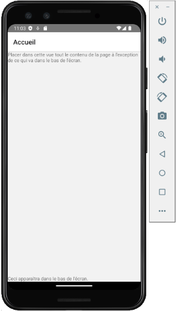

## Contenu qui défile

Dans le cas où la partie principale de l'écran doit pouvoir défiler, il faudra plutôt travailler avec flexGrow: 1.

En effet, la règle flex: 1 est un raccourci pour flex-grow: 1, flex-shrink: 1, flex-basis: 0. Donc, le contenu du ScrollView sera contracté (shrink) à la taille du parent alors il ne pourra plus défiler.

### ScrollView

Voici un exemple avec un ScrollView.

Fichier styles.ts (React Native)

import {StyleSheet} from 'react-native';

 

const styles = StyleSheet.create({  
  conteneur: {  
    flexGrow: 1,  
  },  
  ami: {  
    fontSize: 30,  
    padding: 30,  
  },  
  ...  
});

 

export {styles};

Fichier MonComposant.tsx (Reat Native)

...  
  
 return (  
  <>  
    <ScrollView contentContainerStyle={styles.conteneur}>  
      {amis.map((ami, index) => (  
        <Text style={styles.ami} key={index}>{ami}</Text>  
      ))}  
    </ScrollView>  
    <Text>Ceci apparaîtra dans le bas de l'écran.</Text>  
  </>  
 );

### FlatList

Et voici un exemple avec un [apical\_lien\_interne][flatlist,FlatList][/apical\_lien\_interne].

Fichier src/styles/styles.ts (React Native)

import {StyleSheet} from 'react-native';

 

const styles = StyleSheet.create({  
  conteneur: {  
    flexGrow: 1,  
  },  
  ami: {  
    fontSize: 30,  
    padding: 30,  
  },  
  ...  
});

 

export {styles};

Fichier src/components/MonComposant.tsx (Reat Native)

...  
  
 return (  
  <>  
    <FlatList  
      contentContainerStyle={styles.conteneur}  
      numColumns={1}  
      data={amis}  
      renderItem={({item, index}) => (  
        <Text style={styles.ami} key={index}>{item}</Text>  
      )}  
    />  
    <Text>Ceci apparaîtra dans le bas de l'écran.</Text>  
  </>  
 );

# 13. Les données locales

## 13.1 Modèle pour définir la structure des données

Quand une application React Native a besoin d'une base de données SQLite, elle doit définir un modèle qui indique la structure de chacune des tables.

Les modèles seront placés dans le dossier src/models à la racine du projet.

Fichier src/models/Categorie.ts

export interface Categorie {  
  id: number | null;  
  description: string;  
}

L'interface d'un modèle sera utilisée avec [apical\_lien\_interne][rendre\_une\_variable\_d\_etat\_disponible\_a\_tous\_les\_enfants,le hook useContext][/apical\_lien\_interne] afin qu'une variable d'état qui l'implémente puisse être déclarée dans le plus proche parent et être disponible dans tous les enfants.

## 13.2 Interagir avec SQLite dans une application React Native

## Installation

Pour installer le paquet SQLite pour React Native :

Terminal

cd /chemin/MonProjet

 

npm install --save react-native-sqlite-storage  
npm install --save @types/react-native-sqlite-storage

Il y a des paquets supplémentaires à installer si vous produisez des applications pour iOS mais pas si vous visez Android.

Concentrons-nous sur Android pour l'instant.

### Problème avec jcenter()

Avant d'aller plus loin, essayez de lancer l'application dans l'émulateur.

Si vous obtenez une erreur du genre « A problem occurred evaluating project ':react-native-sqlite-storage'.> Could not find method jcenter() for arguments [] on repository container », vous devez éditer le fichier MonProjet/node\_modules/react-native-sqlite-storage/platforms/android/build.gradle. Vous devez retirer l'instruction jcenter() et la remplacer par  mavenCentral().

Le problème est que JCenter, un gestionnaire de dépendances, [a été fermé en 2024](https://medium.com/@nikhilkhant/jcenters-shutdown-key-alternatives-every-developer-should-know-7499dffa2cdd). Il faut donc le remplacer par un autre gestionnaire de dépendances comme MavenCentral.

Attention : ces modifications seront écrasées si vous [apical\_lien\_interne][recreer\_le\_dossier\_node\_modules,réinstallez les paquets de l'application][/apical\_lien\_interne].

Fichier MonProjet/node\_modules/react-native-sqlite-storage/platforms/android/build.gradle

buildscript {  
    repositories {  
        google()  
        mavenCentral()  
    }

 

    dependencies {  
        ...  
    }  
}  
...

Note : si le problème n'est pas corrigé par les développeurs de react-native-sqlite-storage, il faudra penser à remplacer ce paquet dans vos prochains projets par un paquet dont la maintenance est plus à jour, par exemple [react-native-nitro-sqlite](https://github.com/margelo/react-native-nitro-sqlite).

Au moment d'écrire ces lignes (novembre 2025), [la dernière mise à jour de react-native-sqlite-storage](https://github.com/andpor/react-native-sqlite-storage) datait d'octobre 2021.

## Utilisation

Il est d'usage de coder toutes les requêtes à la base de données dans un même fichier.

Comme pour toutes les requêtes dans une base de données, il faut utiliser des requêtes préparées en SQLite lorsque la requête comprend des variables qui proviennent de l'usager.

Fichier src/services/dbService.ts (React Native)

// inspiré de https://blog.logrocket.com/using-sqlite-with-react-native/  
import {  
  enablePromise,  
  openDatabase,  
  SQLiteDatabase,  
} from 'react-native-sqlite-storage';  
import {Categorie} from './models/Categorie';

 enablePromise(true);  
  
 // cette fonction sera utilisée à chaque fois qu'un composant a besoin de se brancher à la base de données  
export const getDBConnection = async () => {  
  return openDatabase({name: 'mabd.db', location: 'default'});  
};  
  
 export const createTable = async (db: SQLiteDatabase) => {  
  const query = `CREATE TABLE IF NOT EXISTS categories(  
    id INTEGER PRIMARY KEY AUTOINCREMENT,  
    description TEXT NOT NULL  
  );`;  
  
   await db.executeSql(query);  
};  
  
 export const getCategories = async (db: SQLiteDatabase): Promise<Categorie[]> => {  
  try {  
    const categories: Categorie[] = [];  
    // resultat est un tableau de ResultSet  
    const resultat = await db.executeSql(  
      'SELECT id, description FROM categories ...',  
    );  
  
    resultat.forEach(result => {  
      for (let index = 0; index < result.rows.length; index++) {  
        categories.push(result.rows.item(index));  
      }  
    });  
  
    return categories;  
  
  } catch (error) {  
    console.error(error);  
    throw Error('Impossible de retrouver les catégories.');  
  }  
};  
  
 export const ajouterCategorie = async (db: SQLiteDatabase, categorie: Categorie) => { ... };

Pour effectuer une requête préparée :

Fichier src/services/dbService.ts (React Native)

const resultat = await db.executeSql('SELECT id, description FROM categories WHERE id = ?', [id]);

Pour retrouver l'identifiant d'un enregistrement nouvellement ajouté :

Fichier src/services/dbService.ts (React Native)

const resultat = await db.executeSql(requeteInsertion, [donneeChamp1, donneeChamp2, donneeChamp3]);  
 const id = resultat[0].insertId;

Pour initialiser la base de données :

Fichier App.tsx

const App = () => {  
  const [categories, setCategories] = useState<Categorie[]>([]);

   // inspiré de https://blog.logrocket.com/using-sqlite-with-react-native/  
  // \*\*\* initialisation de la BD - crée la table si elle n'existe pas et ajoute des données initiales si elle est vide.  
  // useCallback permet de mettre une fonction en cache entre deux rendus  
  const loadDataCallback = useCallback(async () => {  
    try {  
      const categoriesInitiales = [  
        {id: null, description: 'Catégorie 1'},  
        {id: null, description: 'Catégorie 2'},  
        {id: null, description: 'Catégorie 3'},  
      ];   
      const db = await getDBConnection();  
      await createTable(db);  
      const categoriesBD = await getCategories(db);  
  
      if (categoriesBD.length) {  
        setCategories(categoriesBD);  
      } else {  
        await saveCategories(db, categoriesInitiales);  
        setCategories(categoriesInitiales);  
      }  
    } catch (error) {  
      console.error(error);  
      ...  
    }  
  }, []);  
  
   useEffect(() => {  
    loadDataCallback();  
  }, [loadDataCallback]);  
  
  ...  
  return (  
    // si la liste des données a été initialisée dans ce composant,   
    // on peut la rendre disponible aux composants enfants à l'aide du [apical\_lien\_interne][rendre\_une\_variable\_d\_etat\_disponible\_a\_tous\_les\_enfants,hook useContext][/apical\_lien\_interne]  
    ...  
  );  
};

Pour effectuer une requête à la base de données :

MonComposant.tsx (React Native)

const MonComposant = ({navigation}: Props) => {  
  ...  
  
  // inspiré de https://blog.logrocket.com/using-sqlite-with-react-native/  
  // le nom de cette fonction doit être différent de celui de la fonction définie dans dbService.ts

   const ajouter = async () => {  
    try {  
      // enregistre la catégorie dans la BD  
      const db = await getDBConnection();  
      await ajouterCategorie(db, {id: null, description: description});  
  
       // ajuste la variable d'état de la liste de catégories  
      ...  
  
    } catch (error) {  
      console.error(error);  
      ...  
    }  
  };  
  
  return (  
    ...  
  );  
};

## Pour plus d'information

« Using SQLite with React Native  ». Log Rocket. <https://blog.logrocket.com/using-sqlite-with-react-native/>

## 13.3 Quand plusieurs composants doivent travailler avec la même base de données

Quelques idées :

* Pour chaque composant, se brancher à la BD avant de faire son travail. C'est d'ailleurs l'approche utilisée par <https://blog.logrocket.com/using-sqlite-with-react-native/> (il y a une ligne const db = await getDBConnection(); dans chaque fonction qui a besoin de la BD).
* Stocker la référence à la BD [apical\_lien\_interne][rendre\_une\_variable\_d\_etat\_disponible\_a\_tous\_les\_enfants,dans un contexte][/apical\_lien\_interne].
* Passer la référence à la BD dans chaque route.

Souvent, la liste d'items devra elle aussi être utilisée par plusieurs composants.

Cette fois, l'option de la route ne fonctionnera pas puisque depuis react-navigation 5, passer une fonction de rappel en paramètre à une route pourrait causer des problèmes (voir <https://stackoverflow.com/questions/60114496/passing-function-as-a-param-in-react-navigation-5>).

Quelques idées :

* Stocker la liste [apical\_lien\_interne][rendre\_une\_variable\_d\_etat\_disponible\_a\_tous\_les\_enfants,dans un contexte][/apical\_lien\_interne].
* Dans la route qui mène au composant dans lequel la liste a été déclarée comme variable d'état (c'est la source unique de vérité, single source of truth), recevoir les nouvelles valeurs en paramètre à partir du composant qui a modifié un élément. La liste sera donc toujours mise à jour directement dans la source unique de vérité.

## Pour plus d'information

« How To Use React.Context To Pass Database Reference To Child Components? ». Naroju. <https://www.naroju.com/how-to-use-react-context-to-pass-database-reference-to-child-components/>

« How to use React Context with TypeScript ». LogRocket. <https://blog.logrocket.com/how-to-use-react-context-typescript/>

« Passing function as a param in react-navigation 5 ». Stack Overflow. <https://stackoverflow.com/questions/60114496/passing-function-as-a-param-in-react-navigation-5>

# 14. Accéder à la base de données de l'émulateur

## 14.1 Base de données de l'émulateur Android

Lorsque vous développez une application Android avec React Native, c'est Android Studio qui est responsable de l'émulateur.

C'est le même logiciel qui permet de voir la base de données présente sur l'émulateur et ce, même si l'application a été lancée depuis une fenêtre Terminal plutôt que directement dans l'application.

Pour accéder à la base de données, suivez [apical\_lien\_interne][database\_inspector\_pour\_voir\_la\_base\_de\_donnees\_dans\_l\_emulateur,les instructions pour accéder à Database Inspector][/apical\_lien\_interne].

Si vous désirez effectuer une copie de la base de données ou encore la supprimer de l'émulateur, vous devez connaître son namespace, au format d'un nom de domaine en format inverse.

C'est React Native qui s'est chargé de donner un nom par défaut. Cette information est disponible dans le fichier MonProjet/android/app/build.gradle.

Fichier build.gradle

...

 

android {  
  ndkVersion rootProject.ext.ndkVersion  
  buildToolsVersion rootProject.ext.buildToolsVersion  
  compileSdk rootProject.ext.compileSdkVersion

 

  namespace "com.monprojet"  
  defaultConfig {  
    applicationId "com.monprojet"  
    minSdkVersion rootProject.ext.minSdkVersion  
    targetSdkVersion rootProject.ext.targetSdkVersion  
    versionCode 1  
    versionName "1.0"  
 }  
 ...  
}

Une fois cette information connue, vous pouvez appliquer la technique pour retrouver les fichiers de la base de données dans Android Studio : « [apical\_lien\_interne]voir\_les\_fichiers\_stockes\_sur\_un\_emulateur\_android[/apical\_lien\_interne] ».

# 15. Formulaire React Native

## 15.1 La validation

Dans sa plus simple expression, la validation d'un formulaire React Native consiste à vérifier la valeur d'une variable d'état à l'un de ces moments :

* lorsque cette valeur change;
* lorsque le contrôle perd le focus;
* lors de la soumission du formulaire.

Il est possible d'utiliser des composants spécialisés à cet effet, par exemple [react-hook-form](https://www.react-hook-form.com/), [Yup](https://www.npmjs.com/package/yup) ou [Formik](https://formik.org/). Cependant, effectuer la validation sans utiliser de composant externe vous aidera à mieux comprendre le processus.

## Valider un <TextInput> avec onEndEditing

Pour un composant <TextInput>, l'attribut [onEndEditing](https://reactnative.dev/docs/textinput#onendediting) est tout indiqué pour effectuer la validation. Il permet de déterminer quelle fonction sera exécutée lorsque l'usager aura terminé la saisie, c'est-à-dire lorsque le composant perdra le focus.

Il existe également un attribut [onBlur](https://reactnative.dev/docs/textinput#onblur) mais il pourrait ne pas donner correctement accès à la valeur saisie. C'est pourquoi onEndEditing est préférable pour effectuer la validation.

Quant à l'attribut [onChangeText](https://reactnative.dev/docs/textinput#onchangetext), il est appelé à chaque caractère entré ou effacé alors il causerait l'exécution du code de validation trop fréquemment.

Pour afficher les erreurs de validation, une technique intéressante consiste à initialiser une variable qui dit si la valeur entrée est valide ou non et à afficher un message seulement si la valeur n'est pas valide.

React Native

const [nom, setNom] = useState('');  
  
// la valeur null évite d'afficher le message avant que la validation n'ait eu lieu  
const [nomValide, setNomValide] = useState<boolean | null>(null);  
  
const validerNom = () => {  
  setNomValide(nom.length < 100);  
 };

 

return (  
  ...  
  <TextInput  
    value={nom}  
    onChangeText={setNom}  
    onEndEditing={validerNom}  
  />  
  {nomValide !== null && !nomValide && (  
    <Text style={styles.messageErreur}>  
      Le nom doit ne doit pas comprendre plus de 100 caractères.  
    </Text>  
  )}  
  ...  
);

## 15.2 Configurer le bon clavier virtuel

Le choix du clavier qui apparaît quand on clique sur un élément de formulaire est important pour améliorer l'expérience utilisateur.

Par exemple, pour saisir une valeur numérique :

React Native

<TextInput  
  value={age}  
  onChangeText={setAge}  
  keyboardType="numeric"  
  ...  
 />

Les différents types de claviers sont listés ici : <https://reactnative.dev/docs/0.75/textinput#keyboardtype>

Pour avoir un aperçu de chacun, consultez ce site : <https://www.lefkowitz.me/visual-guide-to-react-native-textinput-keyboardtype-options/>

## 15.3 Cacher le clavier

Dans un formulaire React Native, lorsque l'usager clique sur le bouton de soumission, il est intéressant de cacher le clavier virtuel afin de rendre tout l'espace disponible.

Voici une technique simple pour y arriver : entourer l'écran ou une partie de l'écran dans une balise <ScrollView keyboardShouldPersistTaps='never'>.

Le clavier disparaîtra dès que l'usager clique en dehors d'un TextInput, que ce soit sur le fond de l'écran ou encore sur un bouton.

React Native

<View style={styles.conteneur}>  
  <Text style={styles.titre}>Mon application</Text>  
  <ScrollView keyboardShouldPersistTaps='never'>  
    ...  
    <TextInput ... />

 

    <Button  
      onPress={() => {  
        ...  
      }}  
      title="Cliquer"  
    />  
  </ScrollView>  
 </View>

# 16. Confirmation avant suppression

## 16.1 <Alert>

Avec React Native, [Alert](https://reactnative.dev/docs/alert) permet d'afficher un popup qui permet par exemple d'afficher un message ou de demander une confirmation.

React Native

const confirmerSuppression = (description: string) => {  
  Alert.alert('Confirmation', `Désirez-vous vraiment supprimer l'item ${description}?`, [  
    {  
      text: 'Non',  
      style: 'cancel',  
    },  
    {  
      text: 'Oui',  
      onPress: () => {  
       // procéder à la suppression  
      }  
    },  
  ]);  
 };  
return (  
  ...  
  <Button  
    title="Supprimer"  
    onPress={() => {  
      confirmerSuppression(...)  
    }}  
  />  
  ...  
);

# 17. Quelques réflexions

## 17.1 Ce qui manque pour compléter le CRUD

Discussion en classe

* Comment allez-vous retrouver les données à éditer?
* Si plus d'une technique existe, laquelle est préférable et pourquoi?
* Quand est-ce que les données seront retrouvées? Dans quel hook?
* Après avoir ajouté/édité/supprimé un enregistrement, comment s'assurer que la liste sera à jour dans l'application?

# 18. Les capteurs

## 18.1 L'orientation du téléphone (attitude)

Avant de se lancer dans le développement d'une application mobile qui réagit aux capteurs, prenons le temps de comprendre comment déterminer l'orientation du téléphone.

## Axes par rapport au téléphone

Normalement, on illustre les axes X, Y et Z avec un téléphone debout.

* L'axe des X (rouge) traverse le téléphone de gauche à droite.
* L'axe des Y (vert) traverse le téléphone de bas en haut.
* L'axe des Z (bleu) traverse l'écran de l'arrière vers l'avant.

Pour facilement retenir la couleur de chaque axe, rappelez-vous qu'on a l'habitude de dire dans l'ordre XYZ et RVB donc X est rouge, Y est vert et Z est bleu.

## Orientation

L'orientation (en anglais : attitude) permet de déterminer comment le téléphone est positionné.

Elle est définie à l'aide de trois valeurs qui empruntent des termes au monde nautique : le tangage, le roulis et la direction (anglais pitch, roll, yaw).

Les angles d'orientation sont plus faciles à comprendre avec le téléphone couché afin de visualiser les mêmes angles sur un bateau.

* Le tangage (pitch) est l'angle par rapport à l'axe qui traverse le téléphone de gauche à droite.
* Le roulis ou l'inclinaison (roll) est l'angle par rapport à l'axe longitudinal.
* La direction ou lacet (yaw) est l'angle par rapport à l'axe qui transperce l'écran.

## Sens de la rotation positive

Pour savoir si l'angle est positif ou négatif, on peut s'aider du truc de la main droite.

On place le pouce de la main droite dans le sens positif de l'axe et les doigts indiquent le sens positif de la rotation.

## Animation pour illustrer ces valeurs

Sur le site, de React Native Animated (je sais, on n'utilise pas ici cette bibliothèque mais c'est tout de même utile ;-)), une petite animation vous permet de bien visualiser les valeurs retournées par les différents capteurs lorsque le téléphone est manipulé : <https://docs.swmansion.com/react-native-reanimated/docs/device/useAnimatedSensor/>

Attention cependant : le sens du lacet (yaw) pourrait être différent de celui utilisé par iOS.

## Pour plus d'information

« Axes de rotation d'un aéronef ». Wikipédia. <https://fr.wikipedia.org/wiki/Axes_de_rotation_d%27un_a%C3%A9ronef>

## 18.2 Lire les données d'un capteur dans une application React Native

L'équipe de React Native a commencé à travailler sur une [nouvelle architecture](https://reactnative.dev/architecture/landing-page) en 2018. Cette architecture a été graduellement introduite dans différentes versions tout en permettant de continuer avec l'architecture originale.

Depuis React Native 0.82, sortie en 2025, les applications utilisent la nouvelle architecture de façon obligatoire.

C'est pour cette raison que plusieurs paquets ont des problèmes de compatibilité dans les projets récents.

Au moment d'écrire ces lignes (décembre 2025), il n'y avait pas de paquet disponible pour travailler avec des capteurs dans un projet React Native 0.82 ou plus récent.

La solution consiste alors à créer un projet [apical\_lien\_interne][creer\_une\_application\_react\_native\_et\_la\_lancer\_dans\_l\_emulateur,avec une ancienne version de React Native,ancienneversion][/apical\_lien\_interne], par exemple avec la version 0.75.3 que j'utilisais en 2024. Vous pourrez alors [apical\_lien\_interne][paquet\_react\_native\_sensors,travailler avec le paquet react-native-sensors][/apical\_lien\_interne].

## 18.3 Paquet react-native-sensors

Note : ce paquet n'est plus maintenu depuis 2022 et présente des problèmes de compatibilité avec les versions récentes de React Native basées sur la nouvelle architecture (dernier tests effectués avec React Native 0.82.1 en décembre 2025).  
  
Si vous désirez tout de même l'utiliser, vous devez créer un projet [apical\_lien\_interne][creer\_une\_application\_react\_native\_et\_la\_lancer\_dans\_l\_emulateur,avec une ancienne version de React Native,ancienneversion][/apical\_lien\_interne], par exemple avec la version 0.75.3 que j'utilisais en 2024.

Le paquet [react-native-sensors](https://react-native-sensors.github.io/) permet à une application React Native de réagir face aux données envoyées par un des capteurs du téléphone.

## Installation

Terminal

cd /chemin/MonProjet  
npm install react-native-sensors --save

Si vous obtenez une erreur du genre « EACCES: permission denied », refaites la commande avec sudo.

## Déclaration de l'utilisation des capteurs et demandes de permissions

Tout comme pour une application native Android ou iOS, une application React Native qui utilise des capteurs doit en faire la déclaration et demander les permissions requises.

Les détails sont donnés sur cette fiche : « [apical\_lien\_interne]declarer\_l\_utilisation\_des\_capteurs\_et\_demander\_les\_permissions\_requises[/apical\_lien\_interne] ».

## Utilisation

Pour commencer à écouter un capteur :

React Native

...  
import { accelerometer } from 'react-native-sensors';  
  
const MonComposant = () => {  
  
   setUpdateIntervalForType(SensorTypes.accelerometer, 400); // le défaut est de 100 millisecondes  
  
  const subscription = accelerometer.subscribe(({ x, y, z, timestamp }) => {  
     console.log({ x, y, z, timestamp });  
    ... // faire quelque chose avec les valeurs reçues  
  });  
  
  ...  
}  
  
export default MonComposant;

Il est possible de filtrer les données afin de ne réagir que lorsqu'un écart est observé.

React Native

...  
import { accelerometer } from 'react-native-sensors';

 

import { map, filter } from "rxjs/operators";

 

const MonComposant = () => {  
  // code emprunté inspiré de https://react-native-sensors.github.io/docs/Usage.html  
  const subscription = accelerometer  
    .pipe(  
      map(({x, y, z}) => x + y + z),  
      filter(speed => speed > 20),  
    )  
    .subscribe({  
      next: speed => console.log(`You moved your phone with ${speed}`),  
      error: error => {  
        console.log('The sensor is not available');  
      },  
    });  
  // fin du code emprunté

 

  ...  
}

 

export default MonComposant;

## Note sur les tutoriels en ligne

Soyez vigilents, plusieurs tutoriels présentent du code qui ne fonctionne plus avec la dernière version de react-native-sensors.

Pour un exemple qui fonctionne avec la version 7.3.6 (la version installée dans votre projet apparaît dans le fichier package.json), suivez ce lien : <https://github.com/react-native-sensors/react-native-sensors/blob/master/examples/BasicSensors/SensorView.js>.

## Pour plus d'information

« Install React Native Sensors ». React Native Sensors. <https://react-native-sensors.github.io/docs/Installation.html>

« react-native-sensors/docs/API.md ». GitHub. <https://github.com/react-native-sensors/react-native-sensors/blob/master/docs/API.md>

## 18.4 Déclarer l'utilisation des capteurs et demander les permissions requises

Tout comme pour une application native Android ou iOS, une application React Native qui utilise des capteurs doit en faire la déclaration et demander les permissions requises.

Les étapes sont les mêmes que pour une application native.

Pour Android : « [apical\_lien\_interne]declarer\_l\_utilisation\_des\_capteurs[/apical\_lien\_interne] »

Pour iOS : « [apical\_lien\_interne]permission\_requise\_pour\_travailler\_avec\_un\_capteur[/apical\_lien\_interne] »

Note : si vous obtenez tout de même un message d'erreur dans l'émulateur, comme illustré par l'image plus bas, avec le message « Tu use the sampling rate of 0 microseconds, app needs to declare the normal permission HIGH\_SAMPLING\_RATE\_SENSORS », vous devez reconstruire (build) votre projet afin que les modifications au fichier AndroidManifest.xml soit prises en compte.

Si vous travaillez directement dans la fenêtre dans laquelle la commande npx react-native start a été lancée, appuyez sur la touche r.

Si vous voyez toujours le message, ouvrez une nouvelle fenêtre Terminal, placez-vous dans le dossier de l'application puis entrez la commande npx react-native run-android. Ceci causera une reconstruction complète de l'application.

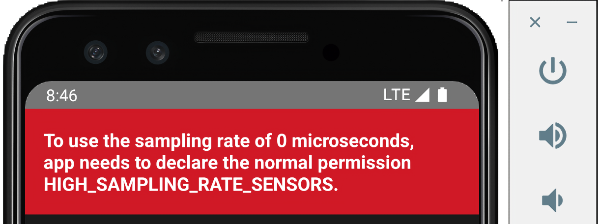

# 19. Utiliser un API

## 19.1 Utiliser fetch avec React Native

L'utilisation de [fetch avec React Native](https://reactnative.dev/docs/network) est très semblable à l'utilisation que l'on en fait en React ou même en JavaScript pur.

Deux syntaxes sont à votre disposition : la syntaxe avec .then() ou celle avec async/await.

## Syntaxe .then() (promesses)

Cette syntaxe est la première qui a été disponible lorsque le mécanisme des promesses a été ajouté à JavaScript dans la version ES2015 (ES6).

Un des avantages de cette syntaxe est qu'elle peut être appelée dans un fonction qui n'est pas asynchrone.

Le fonctionnement de base d'une promesse va comme suit :

React Native

promesse  
.then(...)  
.catch(...)

Voici un exemple d'appel d'API avec fetch et la syntaxe des promesses.

React Native

const appelerApi = () => {  
  fetch(url)  
  .then(response => {  
    if (!response.ok) {  
      // le catch pourra réagir à l'erreur  
      throw new Error(`Erreur API : ${response.status} ${response.statusText}`);  
    }  
    return response.json();   // selon ce que l'API retourne, on pourrait devoir utiliser response.text() ou response.url.  
  }).then(result => {  
    //console.log(result)  
    // faire quelque chose avec les informations générées  
  }).catch(error => {  
    //console.error(error)  
    // réagir en cas d'erreur  
  }).finally(() => {  
    // instructions à faire quand l'appel est terminé ou quand l'appel a échoué  
  });   
 };

## Syntaxe avec async/await

La syntaxe avec async/await est apparue avec JavaScript ES2017 (ES8).

Il s'agit d'un simple sucre syntaxique par-dessus les promesses, qui a l'avantage d'être plus concis.

Si un appel d'API est utilisé dans une fonction, cette fonction doit être asynchrone.

De plus, il faut entourer le fetch d'un try... catch pour récupérer les erreurs potentielles.

React Native

const appelerApi = async () => {  
  try {  
    const response = await fetch(url);  
    if (!response.ok) {  
        throw new Error(`Erreur API : ${response.status} ${response.statusText}`);  
    }  
    const result = await response.json();  
    //console.log(result)  
    // faire quelque chose avec les informations générées  
  } catch (error) {  
    //console.error(error)  
    // réagir en cas d'erreur  
  } finally {  
    // instructions à faire quand l'appel est terminé ou quand l'appel a échoué  
  }  
 };

## Appel de type POST, avec en-tête et corps

Voici un rappel sur la façon d'effectuer une requête de type POST.

J'ai également inclus la technique pour fournir des informations d'en-tête à la requête de même que des informations passées dans le corps.

Syntaxe .then() :

React Native

const appelerApi = () => {  
  fetch(url, {  
    method: 'POST',  
    headers: {  
      'Authorization': ...,  
      'Content-Type': 'application/json',  
    },  
    body: JSON.stringify({  
      ...  
    }),  
  }).then(response => {  
     ...   // même chose qu'avec une requête GET  
  });  
};

Syntaxe async/await :

JavaScript

const appelerApi = async () => {  
  try {  
    const response = await fetch(url, {  
      method: 'POST',  
      headers: {  
        'Authorization': ...,  
        'Content-Type': 'application/json',  
      },  
      body: JSON.stringify({  
        ...  
      }),  
    });  
    ...

 

    const result = await response.json();  
    ...   // même chose qu'avec une requête GET  
  }  
};

## Erreur « TypeError: Network request failed »

Si, sur l'émulateur, vous obtenez l'erreur « TypeError: Network request failed » quand l'application tente d'effectuer la requête API, ceci peut être dû à un problème d'initialisation de l'émulateur.

Une solution consiste à refermer l'émulateur, refermer la fenêtre Metro avec Ctrl + C puis à relancer l'application.

## 19.2 API qui génère des images

Le type d'information retournée par les API qui génèrent des images dépend de la façon dont chaque API est programmée.

Si l'API génère du JSON, son utilisation se fera de la même façon que pour toute autre API.

Mais souvent, les API d'images génèrent directement une image. De façon plus précise, ces API effectuent une redirection pour retourner une image.

La solution la plus simple pour utiliser un tel API est de placer l'URL directement dans une balise <Image>.

React Native

<Image source={{uri: `https://api.dicebear.com/9.x/personas/png?seed=${seed}`}} style={mesStyles.image} />

Si vous tenez à passer par un appel fetch (mais pourquoi vous voudriez faire ça?), il faut utiliser response.url (notez l'absence de parenthèses) afin de récupérer l'URL finale.

Il s'agit souvent de l'URL utilisé pour réaliser le fetch mais parfois, il pourrait avoir été modifié par des redirections.

React Native

const appelerApi = () => {  
  fetch(url)  
  .then(response => {  
    if (!response.ok) {  
      // le catch pourra réagir à l'erreur  
      throw new Error(`Erreur API : ${response.status} ${response.statusText}`);  
    }  
    return response.url;  
  }).then(result => {  
    //console.log(result)   // on verra l'URL  
    // faire quelque chose avec les informations générées  
  }).catch(error => {  
    //console.error(error)  
    // réagir en cas d'erreur  
  }).finally(() => {  
    // instructions à faire quand l'appel est terminé ou quand l'appel a échoué  
  });   
 };

## 19.3 fetch vs Axios

Avant l'arrivée de fetch, aux alentours de 2015, le code JavaScript devait effectuer les requêtes à un API avec [XmlHttpRequests](https://developer.mozilla.org/en-US/docs/Web/API/XMLHttpRequest). C'était un processus plutôt complexe.

Peu de temps après l'arrivée de fetch, aux alentours de 2016, un petit nouveau est entré en piste : la bibliothèque [Axios](https://axios-http.com/docs/intro).

Mais pourquoi installer une bibliothèque tierce pour effectuer un travail qui peut être réalisé avec fetch, considérant que fetch est natif dans tous les navigateurs modernes et dans Node.js (depuis v18)?

Axios offre des fonctionnalités pratiques comme les intercepteurs de requêtes, l'interprétation automatique du JSON (JSON parsing) et une gestion simplifiée des erreurs.

En revanche, il requiert une installation supplémentaire, ce qui augmente légèrement le poids de l'application.

Le choix entre fetch et Axios dépend principalement des préférences personnelles. À vous de choisir!

Sachez qu'en plus d'Axios, d'autres bibliothèques tierces permettent d'effectuer des requêtes à un API en JavaScript, par exemple [Ky](https://github.com/sindresorhus/ky), [Alova](https://github.com/alovajs/alova) et [Redaxios](https://github.com/developit/redaxios) (une version légère d'Axios).

Voici un exemple qui montre une requête API simple avec fetch puis avec Axios.

Dans un premier temps, le code est illustré avec la syntaxe .then().

React Native

fetch('https://reactnative.dev/movies.json')  
.then(response => {  
  if (!response.ok) {  
    throw new Error(`Erreur API : ${response.status} ${response.statusText}`);  
  }  
  return response.json();   
})  
.then(result => {  
  setData(result.movies);  
})  
.catch(error => {  
  console.error(error);  
})  
.finally(() => {  
  ...  
});

React Native

axios.get('https://reactnative.dev/movies.json')  
 .then(response => {  
  setData(response.data.movies);  
 })  
 .catch(error => {  
  // arrivera ici également si la réponse n'est pas ok (code d'état pas entre 200 et 299)  
  console.error(error);  
 })  
 .finally(() => {  
  ...  
 });

Voici ces mêmes extraits de code avec la syntaxe async/await.

React Native

try {  
  // Code de la doc React Native : https://reactnative.dev/docs/network  
  const response = await fetch('https://reactnative.dev/movies.json');  
  if (!response.ok) {  
    throw new Error(`Erreur API : ${response.status} ${response.statusText}`);  
  }  
  const result = await response.json();  
  setData(result.movies);   // met à jour une variable d'état  
} catch (error) {  
  console.error(error);  
 } finally {  
  ...  
 }

React Native

try {  
  const response = await axios.get('https://reactnative.dev/movies.json');  
  setData(response.data.movies);   // met à jour une variable d'état  
 } catch (error) {  
  // arrivera ici également si la réponse n'est pas ok (code d'état pas entre 200 et 299)  
  console.error(error);  
 } finally {  
  ...  
 }

# ────────── Chapitres de référence ──────────

# 20. Dépannage React Native (troubleshooting)

## 20.1 Erreur « Could not read package.json »

### Problème :

Lorsque vous tentez de lancer Metro, le créateur de paquet JavaScript (JavaScript bundler), à l'aide de la commande npm start, vous obtenez le message « npm ERR! enoent Could not read package.json: Error: ENOENT: no such file or directory ».

### Contexte :

* React Native pour Android sous Windows

### Cause possible :

Vous n'avez pas lancé la commande npm start à partir du bon dossier.

### Solution proposée :

Placez votre terminal dans le dossier du projet puis lancez la commande à nouveau.

## 20.2 Erreur « Failed to launch emulator » ou « Failed to install the app »

### Problème :

Lorsque vous tentez de lancer votre application React Native à l'aide de la commande npx react-native run-android,vous obtenez le message « Failed to launch emulator » ou encore « Failed to install the app ».

### Contexte :

* React Native pour Android sous Windows
* npm 10.8.2
* node 20.19.5

### Cause possible :

La variable d'environnement ANDROID\_HOME n'est pas correctement configurée.

### Solution proposée :

Pour savoir où cette variable doit pointer, ouvrez Android Studio et rendez-vous dans le menu Tools / SDK Manager / Languages & Frameworks / Android SDK.

Le chemin à utiliser est affiché vis-à-vis Android SDK Location.

Configurez cette variable dans Windows. Typiquement, ceci est réalisé comme suit mais la procédure peut varier selon votre version de Windows.

Dans le panneau de configuration, cliquez sur Système / lien Paramètres système avancés / Bouton Variables d'environnement.

Sous la section Variables système, cliquez sur Nouvelle.

Nommez la variable ANDROID\_HOME et donnez-lui comme valeur le chemin repéré plus tôt dans Android Studio.

Si vous aviez une fenêtre Terminal ou Powershell ouverte, vous devez la refermer puis la réouvrir pour que les modifications soient prises en compte.

### Autre cause possible :

Aucun périphérique virtuel (AVD - Android Virtual Device, aussi appelé Émulateur ou parfois Simulateur) n'a été créé dans Android Studio.

### Solution proposée :

Créez un périphérique virtuel à partir du menu View / Tool Windows / Device Manaager.

### Autre cause possible :

Il existe bel et bien un émulateur dans Android Studio mais le disque dur n'a pas assez d'espace disponiible pour permettre de lancer l'émulateur.

### Solution proposée :

Libérez de l'espace sur votre disque.

### Autre cause possible :

Le chemin utilisé pour le dossier de l'application est trop long. Ceci générera un message du genre :

error Failed to install the app. Command failed with exit code 1: gradlew.bat app:installDebug -PreactNativeDevServerPort=8081 FAILURE: Build failed with an exception. \* What went wrong: Execution failed for task ':app:buildCMakeDebug[arm64-v8a]'. > com.android.ide.common.process.ProcessException: ninja: Entering directory `C:\...\android\app\.cxx\Debug\691a7144\arm64-v8a' [0/2] Re-checking globbed directories... C++ build system [build] failed while executing: @echo off "C:\\Users\\MonNom\\AppData\\Local\\Android\\Sdk\\cmake\\3.22.1\\bin\\ninja.exe" ^ -C ^ "C:\\...\\android\\app\\.cxx\\Debug\\691a7144\\arm64-v8a" ^ appmodules ^ react\_codegen\_safeareacontext from C:\...\android\app ninja: error: Stat(safeareacontext\_autolinked\_build/CMakeFiles/react\_codegen\_safeareacontext.dir/C\_/.../node\_modules/react-native-safe-area-context/common/cpp/react/renderer/components/safeareacontext/RNCSafeAreaViewShadowNode.cpp.o): Filename longer than 260 characters \* Try: > Run with --stacktrace option to get the stack trace. > Run with --info or --debug option to get more log output. > Run with --scan to generate a Build Scan (Powered by Develocity). > Get more help at https://help.gradle.org. BUILD FAILED in 34s.

### Solution proposée :

Recréez l'application dans un dossier plus près de la racine du disque dur.

## 20.3 Erreur « ENOENT: no such file or directory, lstat 'C:\Users\...\AppData\Roaming\npm' »

### Problème :

Lorsque vous tentez de créer une application React Native avec la commande npx react-native@latest init MonProjet, vous obtenez le message « ENOENT: no such file or directory, lstat 'C:\Users\...\AppData\Roaming\npm' ».

### Contexte :

* React Native pour Android sous Windows
* npm 9.8.1
* node 18.18.2

### Cause possible :

Le dossier C:\Users\...\AppData\Roaming\npm n'existe pas et il est requis pour que la commande npx puisse fonctionner.

### Solution proposée :

Créez le dossier npm à la main sous C:\Users\...\AppData\Roaming.

## 20.4 Erreur « Text strings must be rendered within a <Text> component. »

### Problème :

Lorsque vous tentez de lancer une application React Native, vous obtenez le message « Text strings must be rendered within a <Text> component. ».

### Contexte :

* React Native pour Android sous Windows
* npm 9.8.1
* node 18.18.2

### Cause possible :

Vous avez ajouté un commentaire à côté d'un composant <Text>.

React Native

<Text>Bonjour</Text> {/\*un commentaire\*/}

### Solution proposée :

Vous pouvez soit retirer le commentaire, soit vous assurer qu'il n'y a pas d'espace entre le composant <Text> et le commentaire.

React Native

<Text>Bonjour</Text>{/\*un commentaire\*/}

### Autre cause possible :

Vous avez ajouté un point-virgule à côté d'un composant <Text>.

React Native

<Text>Bonjour</Text>;

### Solution proposée :

Retirer ce point-virgule, il n'a rien à faire là.

React Native

<Text>Bonjour</Text>

## 20.5 Erreur « Your Ruby version is 2.6.8, but your Gemfile specified >= 2.6.10 »

### Problème :

Lorsque vous tentez de démarrer un nouveau projet React Native avec la commande npx react-native@latest init MonProjet, vous obtenez le message « Your Ruby version is 2.6.8, but your Gemfile specified >= 2.6.10 ».

### Contexte :

* React Native pour Android sous macOS
* npm 9.8.1
* node 18.18.2

### Cause possible :

Votre système n'est pas configuré pour utiliser la bonne version de Ruby.

### Solution proposée :

Installez une version récente de Ruby puis configurez votre système pour l'utiliser.

Notez que si le message parle de la version 2.6.10, vous pouvez installer une version plus récente, par exemple 3.2.2.

Commencez par installer le gestionnaire de versions rbenv.

Terminal

brew install rbenv

Installez maintenant la version désirée de Ruby puis configurez votre système pour l'utiliser.

Terminal

rbenv install 3.2.2  
rbenv global 3.2.2  
echo 'export PATH="$HOME/.rbenv/bin:$PATH"' >> ~/.zshrc  
echo 'eval "$(rbenv init -)"' >> ~/.zshrc

Pour que les nouvelles configurations soient prises en compte, refermez votre fenêtre Terminal puis ouvrez-en une nouvelle. Vous pouvez également conserver la même fenêtre et lancer la commande source ~/.zshrc.

## 20.6 Erreur « Possible Unhandled Promise Rejection »

### Problème :

Lorsque vous exécutez votre application React Native, vous obtenez le message « Possible Unhandled Promise Rejection ».

### Contexte :

* React Native pour Android sous macOS
* npm 9.8.1
* node 18.18.2

### Cause possible :

Vous effectuez un appel asynchrone sans l'entourer d'un bloc try... catch.

Le message « Possible Unhandled Promise Rejection » apparaît lorsqu'il y a une erreur dans un appel asynchrone et qu'elle n'est pas traitée dans un catch, ce qui fait que la promesse n'est jamais résolue.

### Solution proposée :

Ajoutez un bloc try... catch.

React Native

try {  
  const db = await getDBConnection();  
  await enregistrerDonnees(db, ...);  
 } catch (error) {  
  console.error(error);  
 }

## 20.7 Erreur « Can't open offline database »

### Problème :

Lorsque vous tentez d'exporter la base de données SQLite de votre application React Native en passant par App Inspection / Clic droit sur la BD / Export as File / SQL, vous obtenez le message « Issue while exporting data. Issue while downloading database. Can't open offline database ».

### Contexte :

* React Native pour Android sous Windows
* IntelliJ 2023.2.2

### Cause possible :

Ceci semble être un bogue sur certaines versions de IntelliJ ou d'Android Studio.

### Solution proposée :

Effectuez l'exportation au format CSV.

Pour convertir le fichier .csv en .sql, vous pouvez utiliser un outil de conversion en ligne, par exemple <https://www.convertcsv.com/csv-to-sql.htm>.

Attention : la plupart des sites de conversion en ligne créent une base de données MySQL.

À vous de l'adapter pour SQLite.

## 20.8 Erreur « Error: EMFILE: too many open files »

### Problème :

Lorsque vous tentez de lancer l'émulateur avec la commande npx react-native start, vous obtenez un message du genre « Error: EMFILE: too many open files, watch at FSWatcher.\_handle.onchange (node:internal/fs/watchers:207:21) ».

### Contexte :

* React Native pour Android sous Windows

### Cause possible :

Il y a un problème quelconque avec le dossier node\_modules.

### Solution proposée :

Supprimez le dossier node\_modules et réinstallez-le à l'aide de la commande npm install.

## 20.9 Erreur « Could not determine the dependencies of task ':app:compileDebugJavaWithJavac'. »

### Problème :

Vous désirez lancer un projet React Native qui a été créé sur un autre poste de travail.

Après avoir recréé le dossier node\_modules avec la commande npm install, lorsque vous lancez l'application avec npx react-native start, vous obtenez le message « Could not determine the dependencies of task ':app:compileDebugJavaWithJavac'. ».

### Contexte :

* React Native pour Android sous Windows

### Cause possible :

...

### Solution proposée :

...

# 21. Quelques notions JavaScript

## 21.1 Les tableaux avec React Native

Prenon l'exemple d'une application React Native qui doit afficher les valeurs d'un tableau dont voici la structure.

React Native

interface Ami {  
  id: number;  
  prenom: string;  
  nomFamille: string;  
}  
  
...  
  
const amis: Ami[] = [  
  {id: 1, prenom: 'Annie', nomFamille: 'Gagnon'},

 

  {id: 2, prenom: 'Justin', nomFamille: 'Bellemare'},  
  {id: 3, prenom: 'Aurélie', nomFamille: 'Dubuc'},  
];

Pour afficher les valeurs d'un tel tableau à l'aide d'une boucle, vous pouvez utiliser la méthode [map()](https://developer.mozilla.org/en-US/docs/Web/JavaScript/Reference/Global_Objects/Array/map).

React Native

{amis.map((ami, i) => (  
  <React.Fragment key={i}>  
    <Text>{ami.prenom}</Text>  
    <Text>{ami.nomFamille}</Text>  
  </React.Fragment>  
 ))}

## Fragments pour spécifier la clé unique

Remarquez l'utilisation [apical\_lien\_interne][les\_fragments,des fragments][/apical\_lien\_interne], c'est-à-dire les balises <React.Fragment></React.Fragment>.  Elles sont l'équivalent de <></> mais elles permettent d'ajouter des propriétés.

Ceci est requis ici puisque si vous ne spécifiez pas de clé unique (attribut key) pour chaque itération, vous obtiendrez ce message d'erreur au bas de l'émulateur : « Each child in a list should have a uniaque "key" prop. ».

Si on n'avait qu'un composant à afficher dans la boucle, il aurait été possible de lui passer directement l'attribut key.

React Native

{amis.map((ami, i) => (  
  <Text key={i}>{ami.prenom}</Text>  
 ))}

## Si la valeur de i n'est pas toujours associée au même élément

React Native a besoin de connaître en tout temps à quel élément la clé est associée. L'utilisation de i fonctionnera dans la majorité des cas.

Mais si le tableau devait être trié, par exemple après l'ajout d'un élément, la valeur de i ne permettrait plus de faire le suivi avec les valeurs originales. Ceci pourrait entraîner des problèmes de performance ou des incohérences dans l'affichage puisque React Native ne pourra plus gérer correctement l'état.

Dans un tel cas, on devra utiliser une valeur qui identifie chaque élément de façon unique, par exemple son identifiant s'il existe.

React Native

{amis.map((ami) => (  
  <React.Fragment key={ami.id}>  
    <Text>{ami.prenom}</Text>  
    <Text>{ami.nomFamille}</Text>  
  </React.Fragment>  
))}

En fait, lorsqu'on a accès à une donnée qui identifie chaque élément de façon unique, on devrait toujours l'utiliser comme clé plutôt que de travailler avec i.

## Ajouter un élément à la fin d'un tableau

Le code qui suit permet d'ajouter un élément à la fin d'un tableau existant.

React Native

setDonnees((donnees) => [...donnees, nouvelleDonnee]);

Voici un extrait de code qui fait la même chose mais de façon plus explicite (explications tirées de <https://react.dev/learn/updating-arrays-in-state>) :

React Native

setDonnees((donnees) =>  
  // remplace le tableau  
  [  
    // avec un nouveau tableau  
    ...donnees, // qui comprend les éléments originaux  
    {id: null, ...}, // et un nouvel élément à la fin  
  ],  
);

## 21.2 Les littéraux de gabarits

En JavaScript, un littéral de gabarit (en anglais : template literal) et une chaîne de caractère dans laquelle une expression peut être introduite et correctement interprétée.

On utilise les guillemets obliques (backticks : `) pour entourer un littéral de gabarit.

JavaScript

const nom = 'Annie';  
 const libelle = `Mon nom est ${nom}.`;   // libellé vaut « Mon nom est Annie. »

À l'intérieur du littéral de gabarit, il faut entourer d'accolades la variable qui doit être interprétée et faire précéder le tout par un signe $.

On peut comparer les littéraux de gabarits JavaScript aux chaînes entourées d'apostrophes en PHP : les deux permettent d'interpréter une variable à l'intérieur de la chaîne.

Cependant, les littéraux de gabarits vont plus loin : ils permettent d'exécuter des fonctions, ce qui n'est pas permis dans une chaîne PHP entourée d'apostrophes.

JavaScript

const libellé = `J'ai ${getAge("1993/06/04")} ans.`;

## Pour plus d'information

« Littéraux de gabarits ». MDN. <https://developer.mozilla.org/fr/docs/Web/JavaScript/Reference/Litt%C3%A9raux_gabarits>

## 21.3 La copie de tableaux JavaScript - par référence, superficielle, profonde

## Copie par référence

Lorsqu'on copie un tableau  JavaScript dans un autre tableau à l'aide de l'opérateur d'assignation, on obtient deux variables qui pointent sur les mêmes cases mémoire.

Autrement dit, toute modification au premier tableau se reflète dans le second tableau.

JavaScript

const tableauOriginal = ['Table', 'Chaise', 'Bureau'];  
const copieReference = tableauOriginal;  
tableauOriginal[1]= 'Lampe';  
console.log(copieReference[1]);   // la copie est également modifiée : 'Lampe'

## Copie superficielle (shallow copy)

Il est souvent préférable de créer une copie du tableau plutôt que de simplement faire pointer le second tableau sur les cases mémoire du premier.

La première technique que je vous présente permet d'effectuer une copie superficielle, c'est-à-dire que les éléments du second tableau seront des copies de celles du premier. Par contre, on dit que la copie est superficielle puisque si les tableaux ont des éléments qui sont des objets, ces éléments dans le second tableau seront des références à ceux du premier tableau.

Voyons d'abord un exemple sans élément objet. Les deux tableaux seront alors complètement distincts.

JavaScript

const tableauOriginal = ['Table', 'Chaise', 'Bureau'];  
const copieSuperficielle = tableauOriginal.slice(0);  
tableauOriginal[1]= 'Lampe';  
console.log(copieSuperficielle[1]);   // la copie est inchangée : 'Chaise'

Maintenant, faisons le test avec des éléments objet.

JavaScript

const tableauOriginal = [  
    {id: 1, description: 'Table'},  
    {id: 2, description: 'Chaise'},  
    {id: 3, description: 'Bureau'},  
];  
  
const copieSuperficielle = tableauOriginal.slice(0);  
tableauOriginal[1].description = 'Lit';  
console.log(copieSuperficielle[1]);   // l'élément objet de la copie est également modifié :   
                                      // {id: 2, description: 'Lit'}

La copie superficielle peut également être réalisée à l'aide de l'[opérateur de décomposition](https://fr.legacy.reactjs.org/docs/jsx-in-depth.html#spread-attributes) (spread operator).

JavaScript

const tableauOriginal = [  
    {id: 1, description: 'Table'},  
    {id: 2, description: 'Chaise'},  
    {id: 3, description: 'Bureau'},  
];  
  
const copieSuperficielle = {...tableauOriginal};  
tableauOriginal[1].description = 'Lit';  
console.log(copieSuperficielle[1]);   // l'élément objet de la copie est également modifié :   
                                      // {id: 2, description: 'Lit'}

## Copie profonde (deep copy)

Avec une copie profonde, tous les éléments du second tableau sont distincts de ceux du premier, même les éléments qui sont des objets.

La technique la plus intéressante pour réaliser une copie profonde consiste à utiliser [structuredClone()](https://developer.mozilla.org/en-US/docs/Web/API/Window/structuredClone).

JavaScript

const tableauOriginal = [  
    {id: 1, description: 'Table'},  
    {id: 2, description: 'Chaise'},  
    {id: 3, description: 'Bureau'},  
];  
  
const copieProfonde = structuredClone(tableauOriginal);  
tableauOriginal[1].description = 'Lit';  
console.log(copieProfonde[1]);   // l'élément objet de la copie demeure inchangé :   
                                 // {id: 2, description: 'Chaise'}

Les deux objets sont vraiment distincts peu importe le niveau de profondeur des éléments objet.

JavaScript

const tableauOriginal = [  
    {id: 1, description: 'Table', categorie: {code: 'a', description: 'Catégorie A'}},  
    {id: 2, description: 'Chaise', categorie: {code: 'b', description: 'Catégorie B'}},  
    {id: 3, description: 'Bureau', categorie: {code: 'c', description: 'Catégorie C'}},  
];  
  
const copieProfonde = structuredClone(tableauOriginal);  
  
tableauOriginal[1].categorie = {code: 'd', description: 'Catégorie D'};  
  
console.log(copieProfonde[1]);   // l'élément objet de la copie demeure inchangé :   
                                // {id: 2, description: 'Chaise', categorie": {code: 'b', description: "Catégorie B'}}

La méthode structuredClone() est largement supportée depuis 2021, mais pas dans tous les environnements. Par exemple, lors de mes tests en React Native en 2025, elle n'était pas implantée.

Dans le code produit avant son arrivée, et dans les environnements où structuredClone() n'est pas implantée, les développeurs utilisent cette astuce pour effectuer un travail à peu près équivalent.

JavaScript

const tableauOriginal = [  
    {id: 1, description: 'Table', categorie: {code: 'a', description: 'Catégorie A'}},  
    {id: 2, description: 'Chaise', categorie: {code: 'b', description: 'Catégorie B'}},  
    {id: 3, description: 'Bureau', categorie: {code: 'c', description: 'Catégorie C'}},  
];  
  
const copieProfonde = JSON.parse(JSON.stringify(tableauOriginal));  
tableauOriginal[1].categorie = {code: 'd', description: 'Catégorie D'};  
console.log(copieProfonde[1]);   // l'élément objet de la copie demeure inchangé :   
                                 // {id: 2, description: 'Chaise', categorie": {code: 'b', description: "Catégorie B'}}

## 21.4 Comment fonctionnent les fonctions fléchées

Les fonctions fléchées (arrow functions), vous connaissez?

Ce concept existe dans différents langages, par exemple JavaScript, Java, Kotlin, Python, PHP.

Dans certains langage, on les appelle plutôt expressions lambda.

Je vous fait une démonstration ici en JavaScript mais les concepts peuvent être étendus aux autres langages si on y apporte quelques ajustements, notamment au niveau de la syntaxe.

Dans cette fiche :

* [Syntaxe de base](https://apical.xyz/formations/pageunique/applications_mobiles_avec_react_native20251210101311#syntaxe)
* [Quelques raccourcis](https://apical.xyz/formations/pageunique/applications_mobiles_avec_react_native20251210101311#raccourcis)
* [Instruction return](https://apical.xyz/formations/pageunique/applications_mobiles_avec_react_native20251210101311#return)
* [Utilisation](https://apical.xyz/formations/pageunique/applications_mobiles_avec_react_native20251210101311#utilisation)
  + [Exemple avec boucle](https://apical.xyz/formations/pageunique/applications_mobiles_avec_react_native20251210101311#boucle)
  + [Exemple avec fetch](https://apical.xyz/formations/pageunique/applications_mobiles_avec_react_native20251210101311#fetch)
* [Quelques différences](https://apical.xyz/formations/pageunique/applications_mobiles_avec_react_native20251210101311#differences)
  + [Déclaration avant utilisation](https://apical.xyz/formations/pageunique/applications_mobiles_avec_react_native20251210101311#declaration)
  + [this](https://apical.xyz/formations/pageunique/applications_mobiles_avec_react_native20251210101311#this)

## Syntaxe de base

Une fonction fléchée, c'est une façon différente, plus concise de déclarer une fonction.

Plutôt que de déclarer une fonction régulière comme ceci :

JavaScript

function faireQuelqueChose() {  
  console.log('Test!');  
}

on déclarera une fonction fléchée comme cela :

JavaScript

const faireQuelqueChose = () => {  
  console.log('Test!');  
}

Remarquez :

* la fonction est assignée à une variable
* il pourrait y avoir des paramètres entre les parenthèses
* la flèche (=>) indique le début du code à exécuter

Dans le cas où la fonction attend un ou plusieurs paramètres, on aura plutôt ceci.

Fonction régulière :

JavaScript

function faireQuelqueChose(unParametre) {  
  console.log(`Paramètre: ${unParametre}!`);  
}

Fonction fléchée :

JavaScript

const faireQuelqueChose = (unParametre) => {  
  console.log(`Paramètre: ${unParametre}!`);  
}

Oui mais la fonction fléchée dans cet exemple n'est pas plus concise que la fonction régulière.

Pour donner un exemple vraiment équivalent, la fonction régulière aurait été elle aussi assignée à une variable. On voit que la syntaxe fléchée est plus concise dans ce contexte.

JavaScript

const faireQuelqueChose = function(unParametre) {  
  console.log(`Paramètre: ${unParametre}!`);  
}

## Quelques raccourcis

Avec une fonction fléchée, il est possible d'omettre les parenthèses alentour du paramètre lorsqu'il n'y en a qu'un seul.

JavaScript

const faireQuelqueChose = unParametre => {  
  console.log(`Paramètre: ${unParametre}!`);  
}

Il est également possible d'omettre les accolades lorsqu'il n'y a qu'une seule instruction et qu'il ne s'agit pas d'un return.

JavaScript

const faireQuelqueChose = unParametre => console.log(`Paramètre: ${unParametre}!`);

Remarquez que plusieurs développeurs préfèrent toujours utiliser les accolades et les parenthèses puisqu'elles contribuent à clarifier le code.

## Instruction return

Lorsque la fonction doit faire un return et qu'elle ne comprend qu'une seule instruction, il n'est pas requis d'écrire le return. Il est implicite.

Version avec return explicite :

JavaScript

const doubler = nombre => { return nombre \* 2 };

Version avec return implicite :

JavaScript

const doubler = nombre => nombre \* 2;

Si on écrit le return, il faut absolument utiliser les accolades même s'il n'y a qu'une seule instruction.

JavaScript

const doubler = nombre => return nombre \* 2;  
console.log(doubler(3)); // Unexpected token 'return'

Et si on désire retourner une valeur et qu'on utilise les accolades, il faut absolument écrire le mot return.

JavaScript

const doubler = nombre => { nombre \* 2 }  
console.log(doubler(3)); // undefined car il y a des accolades sans return

## Utilisation

Que la fonction ait été définie de façon régulière ou en tant que fonction fléchée, elle sera appelée de la même façon.

JavaScript

faireQuelqueChose('Allô!');  
const resultat = doubler(3);

### Exemple avec boucle

On pourrait définir et appeler la fonction fléchée directement comme fonction de rappel (callback function) dans une boucle.

On n'aura alors pas besoin de l'assigner à une variable.

JavaScript

const valeurs = ['A', 'B', 'C'];

 

valeurs.map((unParametre) => {  
  console.log(`Paramètre: ${unParametre}!`);  
})

Sans les fonctions fléchées, le code est moins élégant.

JavaScript

valeurs.map(function(unParametre) {  
  console.log(`Paramètre: ${unParametre}!`);  
})

### Exemple avec fetch

Lorsqu'on réalise un appel AJAX avec fetch, les fonctions fléchées sont particulièrement intéressantes.

JavaScript

fetch('https://...', {  
  method: 'POST',  
  headers: {  
    'Content-Type': 'application/json',  
  },  
  body: JSON.stringify({  
    // ...  
  }),  
 }).then(response => {  
  if (!response.ok) {  
    // le catch pourra réagir à l'erreur  
    throw new Error(`Erreur API : ${response.status} ${response.statusText}`);  
  }  
  return response.json();  
 }).then(result => {  
  console.log(result.message);  
 }).catch(error => {  
  console.log(error);  
 }).finally(() => {  
  // ...  
 });

Sans les fonctions fléchées, le code est ici aussi moins élégant.

JavaScript

fetch('https://...', {  
  method: 'POST',  
  headers: {  
    'Content-Type': 'application/json',  
  },  
  body: JSON.stringify({  
    // ...  
  }),  
 }).then(function(response) {  
  if (!response.ok) {  
    // le catch pourra réagir à l'erreur  
    throw new Error(`Erreur API : ${response.status} ${response.statusText}`);  
  }  
  return response.json();   
 }).then(function(result) {  
  console.log(result.message);  
 }).catch(function(error) {  
  console.log(error);  
 }).finally(function() {  
  // ...  
 });

## Quelques différences

Voyons maintenant quelques différences entre les fonctions régulières et les fonctions fléchées.

### Déclaration avant utilisation

Une fonction régulière peut être appelée dans le haut d'un fichier puis déclarée plus bas.

JavaScript

faireQuelqueChose('Appel avant déclaration');   // ok

 

function faireQuelqueChose(unParametre) {  
  console.log(`Paramètre: ${unParametre}!`);  
}

Avec les fonctions fléchées, il faut absolument déclarer la fonction avant de l'appeler.

JavaScript

faireQuelqueChose('Appel avant déclaration');   // Uncaught ReferenceError: Cannot access 'faireQuelqueChose' before initialization  
  
const faireQuelqueChose = unParametre => {  
  console.log(`Paramètre: ${unParametre}!`);  
}

Par contre, ce code React fonctionne puisque le contenu du hook useEffect n'est exécuté que lorsque le composant est chargé.

JavaScript

useEffect(() => {  
  faireQuelqueChose('ok dans useEffect');  
 }, []);  
  
const faireQuelqueChose = unParametre => {  
  console.log(`Paramètre: ${unParametre}!`);  
}

### this

Dans une fonction régulière, le mot-clé this fait référence au contexte d'exécution.

Par exemple, dans un gestionnaire d'événement, il s'agit de l'élément du DOM qui a déclenché l'événement.

JavaScript

class MaClasse {  
  constructor() {  
    this.bouton = document.getElementById('bouton');  
    this.compteur = 0;       
  }  
  
  maMethode() {      
    this.bouton.addEventListener('click', function() {  
      this.compteur++;   // this est l'élément DOM sur lequel on a cliqué. Ceci n'a aucun effet sur la propriété compteur de la classe.  
    });  
  }  
}  
  
let test = new MaClasse();  
test.maMethode();

Dans une fonction fléchée, le mot-clé this fait référence au contexte dans lequel la fonction a été créée.

Par exemple, à l'intérieur d'une classe, il s'agit de l'instance de la classe.

JavaScript

class MaClasse {  
  constructor() {  
    this.bouton = document.getElementById('bouton');  
    this.compteur = 0;       
  }

 

  maMethode() {  
    this.element.addEventListener('click', () => {  
      this.compteur++;    // this est l'instance de la classe. Ceci fonctionne correctement.  
    });  
  }  
}  
  
let test = new MaClasse();  
test.maMethode();

Voici un exemple que j'ai vécu il y a quelques années dans un programme réel.

Avant de réaliser que les fonctions fléchées pourraient régler mon problème avec this, j'avais développé une astuce pour contourner ce problème.

Ce code fait partie d'une application WordPress qui utilise la bibliothèque [three.js](https://threejs.org/) pour afficher une image 3D.

JavaScript

class MonGestionnaireImages {  
  ...  
  chargerImage( urlImage ) {  
    let referenceAThis = this;   // ici, this est l'instance de la classe

 

    let textureLoader = new THREE.TextureLoader();

 

    textureLoader.load( urlImage,  
       function ( texture ) {  
        var spriteMaterial = new THREE.SpriteMaterial( { map: texture } );

 

        referenceAThis.objet = new THREE.Sprite( spriteMaterial );   // ici, this serait undefined car c'est le code interne de la classe THREE.TextureLoader qui exécute la fonction de rappel  
         ...  
      },  
      ...  
    );

 

  }  
}

Le code serait beaucoup plus élégant avec une fonction fléchée :

JavaScript

class MonGestionnaireImages {  
  ...  
  chargerImage( urlImage ) {  
    let textureLoader = new THREE.TextureLoader();

 

    textureLoader.load( urlImage,  
      (texture) => {  
        var spriteMaterial = new THREE.SpriteMaterial( { map: texture } );  
        this.objet = new THREE.Sprite( spriteMaterial );   // ici, this est l'instance de la classe  
      },  
      ...  
    );   
  }  
}

Selon vous, les parenthèses alentour de texture sont-elles obligatoires?

## Pour plus d'information

« How to Use JavaScript Arrow Functions – Explained in Detail ». Free Code Camp. <https://www.freecodecamp.org/news/javascript-arrow-functions-in-depth/>

# 22. Quelques bibliothèques utiles

## 22.1 react-native-image-picker

Cette bibliothèque permet de sélectionner des images ou vidéo à partir de la caméra du téléphone ou des médias enregistrés.

## Pour plus d'information

« react-native-image-picker ». GitHub. <https://github.com/react-native-image-picker/react-native-image-picker>

## 22.2 React Native Shake Event Detector

Cette bibliothèque permet de détecter quand le téléphone est brassé.

## Pour plus d'information

« React Native Shake Event Detector ». NPM. <https://www.npmjs.com/package/react-native-shake>

## 22.3 react-native-snackbar

Cette bibliothèque permet d'afficher des Snackbars de Material Design pour Android ou pour iOS.

## Pour plus d'information

« react-native-snackbar ». npm. <https://www.npmjs.com/package/react-native-snackbar>

## 22.4 Immer

Cette petite bibliothèque permet de faciliter la gestion de variables immuables.

## Pour plus d'information

« Immer ». immerjs. <https://immerjs.github.io/immer/>

## 22.5 Lodash

Cette bibliothèque contient une série d'utilitaires pour faciliter la manipulation de tableaux, d'objets, etc.

## Pour plus d'information

« Lodash ». Lodash. <https://lodash.com/>

## 22.6 react-native-keyboard-aware-scroll-view

Cette bibliothèque permet de gérer le défilement lors de l'apparition du clavier.

## Pour plus d'information

« react-native-keyboard-aware-scroll-view ». NPM. <https://www.npmjs.com/package/react-native-keyboard-aware-scroll-view>

« Keyboard aware scroll view Android issue ». Stack Overflow. <https://stackoverflow.com/questions/45466026/keyboard-aware-scroll-view-android-issue/46736715#46736715>

## 22.7 react-native-safe-area-context

Cette bibliothèque permet de travailler avec un composant <SafeAreaView> qui assurera que le visuel de l'application ne soit pas caché sous les zones comme la zone de la caméra dans le haut de l'écran.

## Pour plus d'information

« AppAndFlow / react-native-safe-area-context ». GitHub. <https://github.com/AppAndFlow/react-native-safe-area-context>

# 23. Recréer certains dossiers du projet

## 23.1 Recréer le dossier node\_modules

Le dossier node\_modules d'une application React Native est généralement volumineux et il contient un nombre impressionnant de petits fichiers. Par exemple, dans une petite application toute simple que j'ai codée, il pesait 381 Mo et contenait 29 715 fichiers.

Ce dossier peut facilement être recréé à partir des informations du fichier package.json qui liste les dépendances du projet. C'est pourquoi il est d'usage de ne pas l'inclure lorsqu'on crée un dossier compressé du projet. Il ne faut surtout pas l'inclure lorsqu'on soumet le projet à Git.

La procédure qui suit permet donc d'installer un projet React Native sur un autre ordinateur à partir d'un fichier .zip ou à partir de Git.

* Assurez-vous d'avoir pris en note les configurations effecutées dans les fichiers du dossier node\_modules, par exemple [apical\_lien\_interne][interagir\_avec\_sqlite\_dans\_une\_application\_react\_native,celles qui permettent d'utiliser la bibliothèque react-native-sqlite-storage][/apical\_lien\_interne].
* Si ce n'est pas déjà fait, supprimez le dossier node\_modules du projet.
* Supprimez le fichier package-lock.json situé à la racine du projet.
* Dans une fenêtre Terminal, lancez ces commandes.

  Terminal

  cd /chemin/projet  
  npm install
* Au besoin, remettez en place les configurations spécifiques qui avaient été réalisées dans les fichiers du dossier node\_modules.
* Si vous travaillez sous macOS, assurez-vous que le fichier projet/android/gradlew est exécutable.

  Terminal

  cd /chemin/projet/android  
  chmod 777 gradlew
* Vous pouvez maintenant lancer l'application à partir du Terminal.

  Terminal

  cd /chemin/projet  
  npm run android
* Si l'application ne démarre pas, essayez plutôt cette commande. Ceci ouvrira deux fenêtres et la première pourrait vous donner plus d'informations sur ce qui ne va pas.

  Terminal

  cd /chemin/projet  
  npm run android --verbose

## 23.2 Recréer le dossier android

Dans un projet React Native, le dossier Android situé à la base du projet peut être passablement volumineux.

Puisque ce dossier peut être regénéré, il n'est pas utile de l'inclure dans votre outil de suivi de versions.

Pour recréer le dossier Android dans votre application, que j'appellerai ici MonProjet :

* Créez un nouveau projet React Native, que j'appellerai ici ProjetDeBase.
* Ajoutez les paquets dont votre application a besoin.
* Copiez le dossier Android de cette application vide vers l'application MonProjet.
* Il faut maintenant corriger les endroits où le nom du projet est codé en dur :
  + Renommer le dossier MonProjet/android/app/src/main/java/com/projetdebase  en  MonProjet/android/app/src/main/java/com/monprojet.
  + Dans le fichier MonProjet/android/app/src/main/java/com/monprojet/MainActivity.kt, corriger le nom du projet à la ligne getMainComponentName().

    Fichier MainActivity.kt

    override fun getMainComponentName(): String = "MonProjet"

Il reste encore des traces du nom ProjetDeBase dans l'application mais elles n'empêchent pas l'application de fonctionner.

Vous pouvez donc lancer votre projet normalement.

Si vous désirez retirer toutes les traces, ouvrez le projet dans Visual Studio Code et appuyez sur Ctrl + Maj + F sous Windows ou ⌘ Cmd + ⇧ Maj + F sous Mac pour effectuer une recherche du mot ProjetDeBase dans tout le projet puis remplacez chaque occurence par le nom de votre projet.

# 24. ESLint et Prettier

## 24.1 Changer le niveau de sévérité des règles ESLint

Lorsqu'une règle ESLint est définie avec le niveau 2 ou 'error', le code qui enfreint cette règle apparaît avec un souligage ondulé rouge.

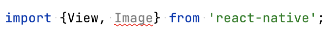

Lorsqu'elle est définie avec le niveau 1 ou 'warn', elle apparaît surlignée en beige.

Si le surlignage rouge vous agresse, il suffit de redéfinir les règles désirées dans le fichier .eslintrc.js avec le niveau 'warn'.

Fichier .eslintrc.js

module.exports = {  
  root: true,  
  extends: '@react-native',  
  rules: {  
    'react-native/no-inline-styles': 'warn',  
    '@typescript-eslint/no-unused-vars': 'warn',  
  },  
};

Ceci est particulièrement utile pour les règles [Prettier](https://prettier.io/) qui, après tout, ne sont pas des erreurs qui empêchent le bon fonctionnement de l'application.

Fichier .eslintrc.js

rules: {  
  ...,  
  'prettier/prettier': 'warn',  
 },

## 24.2 Désactiver ESLint

## Désactiver une seule règle pour un fichier

D'abord, repérez le nom de la règle que vous désirez désactiver. Il suffit d'écrire du code qui transgresse cette règle puis de pointer la souris sur le code en erreur.

Pour désactiver cette règle, entrez ceci dans le haut du fichier en remplaçant @typescript-eslint/no-unused-vars par le nom de la règle à désactiver :

React Native

/\* eslint-disable @typescript-eslint/no-unused-vars \*/

Pour désactiver plusieurs règles, il faut les séparer par des virgules.

React Native

/\* eslint-disable @typescript-eslint/no-unused-vars, react-native/no-inline-styles \*/

## Désactiver toutes les règles pour un fichier

Pour ne plus voir les avertissements ESLint dans un seul fichier, ajoutez ceci dans le haut du fichier :

React Native

/\* eslint-disable \*/

## Désactiver une règle pour tous les fichiers

Si vous désirez qu'une règle ne soit plus prise en compte dans tous les fichiers du projet, il faut lui donner le niveau de sévérité 0 ou 'off' dans le fichier .eslintrc.js.

Fichier .eslintrc.js

module.exports = {  
  root: true,  
  extends: '@react-native',  
  rules: {  
    '@typescript-eslint/no-unused-vars': 'off',  
  },  
};

Ceci permet notamment de désactiver les règles Prettier, qui sont sans effet sur le fonctionnement de l'application.

Fichier .eslintrc.js

rules: {  
  ...,  
  'prettier/prettier': 'off',  
},

## Désactiver toutes les règles pour tous les fichiers

La façon la plus simple de complètement désactiver ESLint d'un projet sans pour autant le supprimer consiste à créer un fichier nommé .eslintignore à la racine du projet et d'y ajouter une seule ligne :

Fichier .eslintignore

\*\*/\*.\*

## Pour plus d'information

« Configure Rules ». ESLint. <https://eslint.org/docs/latest/use/configure/rules>

« Rules Reference ». ESLint. <https://eslint.org/docs/latest/rules/>

« eslint-plugin-react-native ». GitHub. <https://github.com/Intellicode/eslint-plugin-react-native>

« Ignore Files ». ESLint. <https://eslint.org/docs/latest/use/configure/ignore>

# 25. Code propre à une plateforme

## 25.1 Ajuster le code pour iOS ou pour Android

Afin de créer une application qui respecte l'apparence et les comportements habituels (look and feel) de la plateforme cible, il est possible d'ajotuer du code spécifique pour iOS ou pour Android.

La documentation officielle de React Native donne des exemples concrets de ce qui peut être réalisé.

## Pour plus d'information

« Platform-Specific Code ». React Native. <https://reactnative.dev/docs/platform-specific-code>