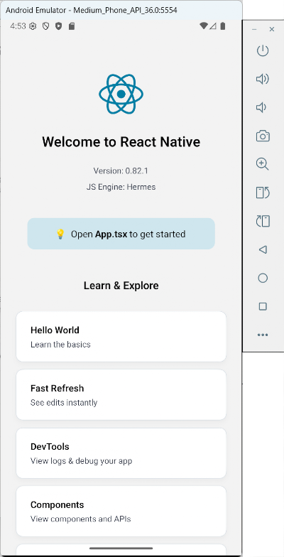

# 3. Création et lancement d'un projet React Native

# 3. Création et lancement d'un projet React Native

## 3.1 Créer une application React Native et la lancer dans l'émulateur

Un projet React Native est créé à l'aide d'une commande dans une fenêtre Terminal.

Dans cette fiche :

* [Création des fichiers de base](https://apical.xyz/formations/pageunique/applications_mobiles_avec_react_native20251210101311#base)
  + [Créer un projet dans une ancienne version de React Native](https://apical.xyz/formations/pageunique/applications_mobiles_avec_react_native20251210101311#ancienneversion)
* [Lancer l'application avec Metro](https://apical.xyz/formations/pageunique/applications_mobiles_avec_react_native20251210101311#metro)
* [Quelques solutions aux problèmes rencontrés](https://apical.xyz/formations/pageunique/applications_mobiles_avec_react_native20251210101311#probleme)

## Création des fichiers de base

D'abord, placez-vous dans le dossier qui contiendra vos projets.

Attention : ne placez pas les projets dans un dossier dont le chemin est trop long sinon, vous risquez d'obtenir un message d'erreur qui indique que la limite de 260 caractères est dépassée (Filename longer than 260 characters).

Terminal

cd /dossier/sousdossier

Lancez ensuite cette commande pour créer les fichiers de base du projet :

Terminal

npx @react-native-community/cli init MonProjet

Notez que la commande précédente, qui crée les fichiers de base, remplace la suivante, qui a été retirée en 2024 :

Terminal

npx react-native@latest init MonProjet

Attention : si vous obtenez l'erreur « npx : Impossible de charger le fichier C:\Program Files\nodejs\npx.ps1, car l'exécution de scripts est désactivée sur ce système. », c'est que vous devez d'abord lancer cette commande :

Terminal

Set-ExecutionPolicy Unrestricted -Scope CurrentUser -Force

### Créer un projet dans une ancienne version de React Native

Si vous désirez plutôt créer un projet dans une ancienne version de React Native, par exemple dans la version 0.75.3 :

Terminal

npx @react-native-community/cli init MonProjet --version 0.75.3

Suivi de :

Terminal

cd MonProjet/android  
./gradlew clean

## Lancer l'application avec Metro

Pour lancer une application React Native, il n'est pas nécessaire qu'Android Studio soit en cours d'exécution. Son utilité se résumait à installer les outils SDK et à créer des émulateurs.

Pour convertir le code JavaScript en application Android ou iOS, React Native utilise [Metro](https://metrobundler.dev/).

Après la conversion, cet environnement permet de lancer l'application dans l'émulateur ou [apical\_lien\_interne][executer\_une\_application\_react\_native\_sur\_un\_telephone\_android,lsur un appareil mobile][/apical\_lien\_interne].

Dans certains sens, on peut comparer Metro pour React-Native à un serveur Web pour PHP.

Une fois les fichiers de base créés, même si vous n'avez encore rien codé, vous pouvez lancer l'application à l'aide de Metro grâce à cette commande :

Terminal

cd /chemin/MonProjet

 

npx react-native run-android

La commande suivante permet de faire la même chose mais elle dépend d'une configuration du fichier package.json situé à la racine du projet :

Terminal

cd /chemin/MonProjet  
npm run android

Avant la version 0.77 de Metro, il était possible de lancer l'application à partir de cette commande :

Terminal

cd /chemin/MonProjet  
npx react-native start

On pouvait appuyer sur la lettre a pour lancer dans Android ou sur i pour lancer dans iOS. Ceci n'est désormais plus possible.

La première fois que vous lancez un projet, vous devez être patients (j'ai déjà vu une attente de 5 à 10 minutes). Les lancements suivants seront plus rapides.

Une fois l'application lancée dans l'émulateur, la console vous affichera ceci :

Résultat à l'écran

info Starting the app on "emulateor-9999" ...

 

Starting: intent { act=android.intent.action. MAIN ... ./MainActivity }

Et l'émulateur affichera l'application de base :

Si vous obtenez un écran noir, vous devez cliquer sur l'icône Power à droite de l'émulateur afin de mettre l'émulateur en marche.

Pendant le lancement, remarquez que la fenêtre Metro est ouverte puis couverte par d'autres fenêtres.

Au besoin, il est possible de cliquer sur la fenêtre Metro pour accéder à différents outils.

Parmi les fonctionnalités disponibles à partir de la fenêtre Metro, notons qu'il est possible de recharger l'application en appuyant sur la touche r ou encore accéder aux outils de développement en appuyant sur la touche j.

## Quelques solutions aux problèmes rencontrés

En cas de problème, cette commande pourrait vous mettre sur la bonne piste :

Terminal

npx react-native doctor

Parfois, vider le cache de Metro permet de régler des problèmes.

Terminal

npx react-native start --reset-cache

Vous pouvez aussi tenter cette commande :

Terminal

cd MonProjet/android  
./gradlew clean

Pour en savoir plus sur le système et les bibliothèques utilisées par React Native :

Terminal

npx react-native info

Pour redémarrer le serveur adb (Android Debug Bridge), l'outil qui se charge de faire le pont entre l'émulateur et l'ordinateur :

Terminal

adb kill-server  
adb start-server

Les manipulations suivantes sont souvent aidantes :

* refermer l'émulateur
* refermer la fenêtre Metro avec Ctrl + C
* relancer l'application.

Toujours lors du lancement de l'application dans l'émulateur, si vous obtenez une erreur du genre « Syntax error in cmake code when parsing string ... invalid character escape \U », ceci est dû à l'utilisation de l'outil [CMake](https://cmake.org/) sous Windows. Le problèmes est dû aux barres obliques inverses (\) utilisées par Windows, qui ne sont pas supportées par CMake. Ce problème est présent seulement sur certaines versions de React Native, par exemple la version 0.76.

La solution consiste à utiliser une ancienne version d'Android, par exemple la version 0.75.

## Pour plus d'information

« Troubleshooting ». React Native. <https://reactnative.dev/docs/troubleshooting>

## 3.2 Environnement Web pour tester une application React Native

[Expo Snack](https://snack.expo.dev/) est un environnement de développement Web qui permet de développer et de tester des applications React Native directement dans le navigateur.

Un exemple d'utilisation est donné dans ce tutoriel : <https://www.freecodecamp.org/news/react-native-networking-api-requests-using-fetchapi/>

## 3.3 Expo

[Expo](https://expo.dev/) est un cadre d'application qui facilite la création d'applications React Native. Il permet de tester les applications dans son interface Expo GO.

Cet environnement convient pour la grande majorité des applications React Native.

Notez qu'il ne s'agit pas d'un simple environnement de développement. Les applications créées avec Expo auront une structure différentes de celles créées directement avec React Native CLI.

Il faut savoir que certains modules pourraient ne pas être disponibles dans Expo. Aussi, les applications seront plus lourdes que celles déveloopées avec React Native CLI.

## Pour plus d'information

« Expo vs React Native CLI: Key Differences Explained ». Swovo. <https://swovo.com/blog/expo-vs-react-native/>

« Should you use Expo or Bare React Native? ». Medium. <https://medium.com/@andrew.chester/should-you-use-expo-or-bare-react-native-8dd400f4a468>

« Why Choose React Native Expo Over React Native CLI in 2025 ». Dev.to. <https://dev.to/singhvishal802/why-choose-react-native-expo-over-react-native-cli-in-2025-1087>