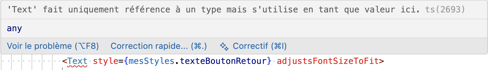
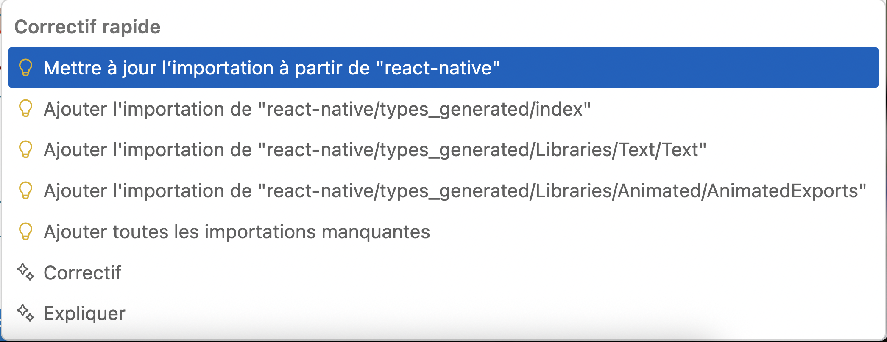

# 5. VS Code

# 5. VS Code

## 5.1 Choisir le meilleur IDE

Pour développer une application React Native, Android Studio est requis pour avoir accès à un émulateur. Cependant, il n'est pas le seul environnement de développement à votre disposition.

Voici quelques choix qui s'offrent à vous :

* [apical\_lien\_interne][visual\_studio\_code\_pour\_react\_native,Visual Studio Code][/apical\_lien\_interne]
* [WebStorm](https://www.jetbrains.com/webstorm/)
* Android Studio (évidemment!)
* [Deco IDE](https://www.decoide.org/)

## 5.2 Visual Studio Code pour React Native

Visual Studio Code est un environnement de développement intégré très flexible et adapté à plusieurs langages de programmation.

Il est un joueur de choix pour développer des applications React Native.

Je vous propose quelques pistes pour qu'il soit bien adapté à ce langage.

## Quelques extensions

React Native Tools : <https://microsoft.github.io/vscode-react-native/>

## Quelques raccourcis-clavier

| Raccourci Windows | Rôle | Équivalent Mac |
| --- | --- | --- |
| Ctrl + K, C | Mettre en commentaire (maintenir la touche Ctrl ou Cmd quand vous appuyez sur C) | ⌘ Cmd + K, C |
| Ctrl + K, U | Enlever les marques de commentaire | ⌘ Cmd + K, U |
| Ctrl + Maj + K | Supprimer une ligne | ⌘ Cmd + ⇧ Maj + K |
| Maj + Alt + Flèche bas | Dupliquer une ligne | ⇧ Maj + ⌥ Option + Flèche bas |
| Ctrl + K, F | Refaire l'indentation du code sélectionné (VS Code nous demandera de configurer le formateur par défaut selon le langage de programmation utilisé) | ⌘ Cmd + K, F |
| Maj + Alt + souris | Effectuer une sélection rectangulaire. Le point d'insertion doit être placé au début de la zone à sélectionner avant d'appuyer sur les touches. | ⇧ Maj + ⌥ Option + souris |
| Maj + Ctrl + L | Sélectionner toutes les occurences du mot actuellement sélectionné, créant une sélection multiple | ⇧ Maj + ⌘ Cmd + L |
| Ctrl + D | Sélectionner la prochaine occurence du mot actuellement sélectionné, créant une sélection multiple | ⌘ Cmd + D |

## 5.3 Gérer les importations

Lorsqu'on code en React Native, il y a une foule d'importations à réaliser.

Heureusement, VS Code offre des fonctionnalités pour faciliter ce travail.

## Ajout d'un import manquant

Dès que vous ajoutez un élément non connu, VS Code le souligne en rouge.

Pour ajouter automatiquement le import correspondant :

* Faites pointer la souris sur le mot en rouge OU cliquez sur le mot puis appuyez sur Ctrl + . sous Windows ou ⌘ Cmd+. sous Mac.

  
* Choisissez Mettre à jour l'importation à partir de ....

  

## Retirer les import inutilisés

Inversement, si vous avez fait un import puis avez retiré l'élément qui nécessitait ce import, VS Code peut faire le ménage pour vous.

* Dans la liste des import, faites pointer la souris sur un mot grisé OU cliquez sur le mot puis appuyez sur Ctrl + . sous Windows ou ⌘ Cmd+. sous Mac.

  
* Sélectionnez Supprimer la déclaration inutilisée pour ... ou Supprimer toutes les importations inutilisées.

  