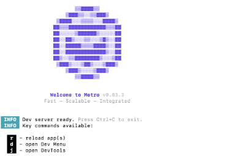
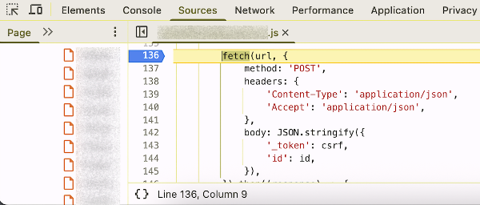
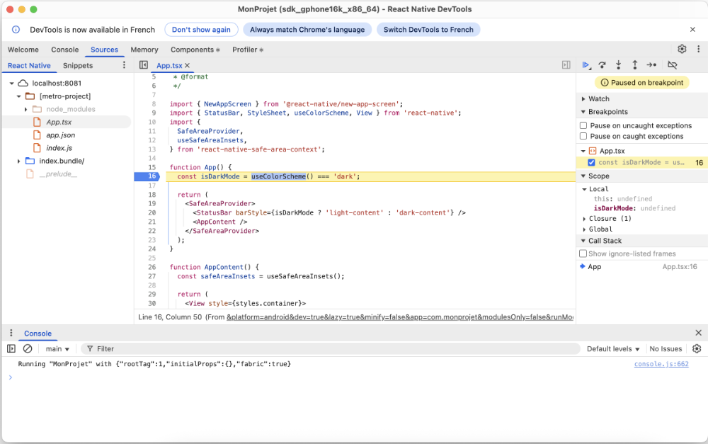

# 9. Déboguer une application React Native

# 9. Déboguer une application React Native

## 9.1 Menu Dev de l'émulateur

Pour ouvrir le menu Dev de l'émulateur :

* Dans la fenêtre Metro, appuyez sur d

  

  ou
* Dans la fenêtre de l'émulateur, appuyez sur Ctrl + M sous Windows ou Cmd ⌘ + M sous macOS.

Un menu apparaîtra directement dans l'émulateur et vous offrira différentes options utiles.

## 9.2 Les outils de développement (DevTools)

Pour ouvrir les outils de développement de React Native :

* Dans la fenêtre Metro, appuyez sur j

  

  ou
* Dans la fenêtre de l'émulateur, appuyez sur Ctrl + M sous Windows ou Cmd ⌘ + M sous macOS puis sélectionnez Open DevTools.

Une fois ce menu ouvert, vous avez accès à des outils de débogage qui ressemblent à ceux de Google Chrome.

Vous pouvez :

* Cliquer sur l'onglet Console pour accéder à une console qui permet de voir des messages et d'évaluer des expressions
* Cliquer sur l'onglet Sources pour voir le code JavaScript, interroger des variables et mettre des points d'arrêt
* Cliquer sur l'onglet Components pour questionner l'état d'un composant
* etc.

## Pour plus d'information

« Debugging Basics ». React Native. <https://reactnative.dev/docs/debugging>

« React Native DevTools ». React Native. <https://reactnative.dev/docs/react-native-devtools>

## 9.3 console.log()

Dans une application React Native, il est possible d'utiliser console.log() pour afficher un message et ainsi faciliter le débogage.

Par exemple, pour afficher la valeur de la variable maVariable, vous pouvez utiliser cette commande :

React Native

console.log(`maVariable: ${maVariable}`);

Le résultat apparaîtra dans [apical\_lien\_interne][les\_outils\_de\_developpement\_devtools,la fenêtre DevTools][/apical\_lien\_interne], onglet Console.

Notez qu'auparavant, ils apparaissaient dans le Terminal de Metro mais ce comportement a changé depuis l'arrivée de [React Native 0.77](https://reactnative.dev/blog/2025/01/21/version-0.77) en janvier 2025.

## 9.4 Ajouter un point d'arrêt dans React ou React Native

Les points d'arrêt sont un outil indispensable lorsqu'on débogue une application.

Je vous montre ici comment ajouter un point d'arrêt pour déboguer du code React et du code React Native à l'aide de différentes techniques :

* [Dans les outils de développement](https://apical.xyz/formations/pageunique/applications_mobiles_avec_react_native20251210101311#outilsdeveloppement)
* [Par programmation (commande debugger)](https://apical.xyz/formations/pageunique/applications_mobiles_avec_react_native20251210101311#debugger)

## Dans les outils de développement

Pour placer un point d'arrêt à partir des outils de développement :

* dans un projet React, utiliser les outils de développement du navigateur. Par exemple, lorsque le code est exécuté dans Chrome : clic droit / Inspecter;
* dans un projet React Native, appuyer sur j dans la fenêtre Metro.

Dans les deux cas, l'onglet Sources donne accès au code source en cours d'exécution. Un clic sur une ligne ajoutera un point d'arrêt.

Voici un exemple en React.

Et voici un exemple en React Native.

Notez que dans la fenêtre Metro, il est possible d'appuyer sur la touche r pour lancer l'application à nouveau.

Ceci est souvent utile pour exécuter à nouveau du code rencontré seulement lors du lancement de l'application.

## Par programmation (commande debugger)

Il est également possible d'ajouter un point d'arrêt par programmation en ajoutant la commande [debugger](https://dev.to/colocodes/how-to-debug-a-react-app-51l4#using-the-raw-debugger-endraw-statement) dans le code à l'endroit où l'on veut que le débogueur s'arrête.

En React comme en React Native, le point d'arrêt ne sera pris en compte que s'il est rencontré alors que les outils de développement sont ouverts.