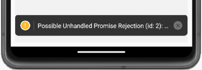

# 20. Dépannage React Native (troubleshooting)

# 20. Dépannage React Native (troubleshooting)

## 20.1 Erreur « Could not read package.json »

### Problème :

Lorsque vous tentez de lancer Metro, le créateur de paquet JavaScript (JavaScript bundler), à l'aide de la commande npm start, vous obtenez le message « npm ERR! enoent Could not read package.json: Error: ENOENT: no such file or directory ».

### Contexte :

* React Native pour Android sous Windows

### Cause possible :

Vous n'avez pas lancé la commande npm start à partir du bon dossier.

### Solution proposée :

Placez votre terminal dans le dossier du projet puis lancez la commande à nouveau.

## 20.2 Erreur « Failed to launch emulator » ou « Failed to install the app »

### Problème :

Lorsque vous tentez de lancer votre application React Native à l'aide de la commande npx react-native run-android,vous obtenez le message « Failed to launch emulator » ou encore « Failed to install the app ».

### Contexte :

* React Native pour Android sous Windows
* npm 10.8.2
* node 20.19.5

### Cause possible :

La variable d'environnement ANDROID\_HOME n'est pas correctement configurée.

### Solution proposée :

Pour savoir où cette variable doit pointer, ouvrez Android Studio et rendez-vous dans le menu Tools / SDK Manager / Languages & Frameworks / Android SDK.

Le chemin à utiliser est affiché vis-à-vis Android SDK Location.

Configurez cette variable dans Windows. Typiquement, ceci est réalisé comme suit mais la procédure peut varier selon votre version de Windows.

Dans le panneau de configuration, cliquez sur Système / lien Paramètres système avancés / Bouton Variables d'environnement.

Sous la section Variables système, cliquez sur Nouvelle.

Nommez la variable ANDROID\_HOME et donnez-lui comme valeur le chemin repéré plus tôt dans Android Studio.

Si vous aviez une fenêtre Terminal ou Powershell ouverte, vous devez la refermer puis la réouvrir pour que les modifications soient prises en compte.

### Autre cause possible :

Aucun périphérique virtuel (AVD - Android Virtual Device, aussi appelé Émulateur ou parfois Simulateur) n'a été créé dans Android Studio.

### Solution proposée :

Créez un périphérique virtuel à partir du menu View / Tool Windows / Device Manaager.

### Autre cause possible :

Il existe bel et bien un émulateur dans Android Studio mais le disque dur n'a pas assez d'espace disponiible pour permettre de lancer l'émulateur.

### Solution proposée :

Libérez de l'espace sur votre disque.

### Autre cause possible :

Le chemin utilisé pour le dossier de l'application est trop long. Ceci générera un message du genre :

error Failed to install the app. Command failed with exit code 1: gradlew.bat app:installDebug -PreactNativeDevServerPort=8081 FAILURE: Build failed with an exception. \* What went wrong: Execution failed for task ':app:buildCMakeDebug[arm64-v8a]'. > com.android.ide.common.process.ProcessException: ninja: Entering directory `C:\...\android\app\.cxx\Debug\691a7144\arm64-v8a' [0/2] Re-checking globbed directories... C++ build system [build] failed while executing: @echo off "C:\\Users\\MonNom\\AppData\\Local\\Android\\Sdk\\cmake\\3.22.1\\bin\\ninja.exe" ^ -C ^ "C:\\...\\android\\app\\.cxx\\Debug\\691a7144\\arm64-v8a" ^ appmodules ^ react\_codegen\_safeareacontext from C:\...\android\app ninja: error: Stat(safeareacontext\_autolinked\_build/CMakeFiles/react\_codegen\_safeareacontext.dir/C\_/.../node\_modules/react-native-safe-area-context/common/cpp/react/renderer/components/safeareacontext/RNCSafeAreaViewShadowNode.cpp.o): Filename longer than 260 characters \* Try: > Run with --stacktrace option to get the stack trace. > Run with --info or --debug option to get more log output. > Run with --scan to generate a Build Scan (Powered by Develocity). > Get more help at https://help.gradle.org. BUILD FAILED in 34s.

### Solution proposée :

Recréez l'application dans un dossier plus près de la racine du disque dur.

## 20.3 Erreur « ENOENT: no such file or directory, lstat 'C:\Users\...\AppData\Roaming\npm' »

### Problème :

Lorsque vous tentez de créer une application React Native avec la commande npx react-native@latest init MonProjet, vous obtenez le message « ENOENT: no such file or directory, lstat 'C:\Users\...\AppData\Roaming\npm' ».

### Contexte :

* React Native pour Android sous Windows
* npm 9.8.1
* node 18.18.2

### Cause possible :

Le dossier C:\Users\...\AppData\Roaming\npm n'existe pas et il est requis pour que la commande npx puisse fonctionner.

### Solution proposée :

Créez le dossier npm à la main sous C:\Users\...\AppData\Roaming.

## 20.4 Erreur « Text strings must be rendered within a <Text> component. »

### Problème :

Lorsque vous tentez de lancer une application React Native, vous obtenez le message « Text strings must be rendered within a <Text> component. ».

### Contexte :

* React Native pour Android sous Windows
* npm 9.8.1
* node 18.18.2

### Cause possible :

Vous avez ajouté un commentaire à côté d'un composant <Text>.

React Native

<Text>Bonjour</Text> {/\*un commentaire\*/}

### Solution proposée :

Vous pouvez soit retirer le commentaire, soit vous assurer qu'il n'y a pas d'espace entre le composant <Text> et le commentaire.

React Native

<Text>Bonjour</Text>{/\*un commentaire\*/}

### Autre cause possible :

Vous avez ajouté un point-virgule à côté d'un composant <Text>.

React Native

<Text>Bonjour</Text>;

### Solution proposée :

Retirer ce point-virgule, il n'a rien à faire là.

React Native

<Text>Bonjour</Text>

## 20.5 Erreur « Your Ruby version is 2.6.8, but your Gemfile specified >= 2.6.10 »

### Problème :

Lorsque vous tentez de démarrer un nouveau projet React Native avec la commande npx react-native@latest init MonProjet, vous obtenez le message « Your Ruby version is 2.6.8, but your Gemfile specified >= 2.6.10 ».

### Contexte :

* React Native pour Android sous macOS
* npm 9.8.1
* node 18.18.2

### Cause possible :

Votre système n'est pas configuré pour utiliser la bonne version de Ruby.

### Solution proposée :

Installez une version récente de Ruby puis configurez votre système pour l'utiliser.

Notez que si le message parle de la version 2.6.10, vous pouvez installer une version plus récente, par exemple 3.2.2.

Commencez par installer le gestionnaire de versions rbenv.

Terminal

brew install rbenv

Installez maintenant la version désirée de Ruby puis configurez votre système pour l'utiliser.

Terminal

rbenv install 3.2.2  
rbenv global 3.2.2  
echo 'export PATH="$HOME/.rbenv/bin:$PATH"' >> ~/.zshrc  
echo 'eval "$(rbenv init -)"' >> ~/.zshrc

Pour que les nouvelles configurations soient prises en compte, refermez votre fenêtre Terminal puis ouvrez-en une nouvelle. Vous pouvez également conserver la même fenêtre et lancer la commande source ~/.zshrc.

## 20.6 Erreur « Possible Unhandled Promise Rejection »

### Problème :

Lorsque vous exécutez votre application React Native, vous obtenez le message « Possible Unhandled Promise Rejection ».

### Contexte :

* React Native pour Android sous macOS
* npm 9.8.1
* node 18.18.2

### Cause possible :

Vous effectuez un appel asynchrone sans l'entourer d'un bloc try... catch.

Le message « Possible Unhandled Promise Rejection » apparaît lorsqu'il y a une erreur dans un appel asynchrone et qu'elle n'est pas traitée dans un catch, ce qui fait que la promesse n'est jamais résolue.

### Solution proposée :

Ajoutez un bloc try... catch.

React Native

try {  
  const db = await getDBConnection();  
  await enregistrerDonnees(db, ...);  
 } catch (error) {  
  console.error(error);  
 }

## 20.7 Erreur « Can't open offline database »

### Problème :

Lorsque vous tentez d'exporter la base de données SQLite de votre application React Native en passant par App Inspection / Clic droit sur la BD / Export as File / SQL, vous obtenez le message « Issue while exporting data. Issue while downloading database. Can't open offline database ».

### Contexte :

* React Native pour Android sous Windows
* IntelliJ 2023.2.2

### Cause possible :

Ceci semble être un bogue sur certaines versions de IntelliJ ou d'Android Studio.

### Solution proposée :

Effectuez l'exportation au format CSV.

Pour convertir le fichier .csv en .sql, vous pouvez utiliser un outil de conversion en ligne, par exemple <https://www.convertcsv.com/csv-to-sql.htm>.

Attention : la plupart des sites de conversion en ligne créent une base de données MySQL.

À vous de l'adapter pour SQLite.

## 20.8 Erreur « Error: EMFILE: too many open files »

### Problème :

Lorsque vous tentez de lancer l'émulateur avec la commande npx react-native start, vous obtenez un message du genre « Error: EMFILE: too many open files, watch at FSWatcher.\_handle.onchange (node:internal/fs/watchers:207:21) ».

### Contexte :

* React Native pour Android sous Windows

### Cause possible :

Il y a un problème quelconque avec le dossier node\_modules.

### Solution proposée :

Supprimez le dossier node\_modules et réinstallez-le à l'aide de la commande npm install.

## 20.9 Erreur « Could not determine the dependencies of task ':app:compileDebugJavaWithJavac'. »

### Problème :

Vous désirez lancer un projet React Native qui a été créé sur un autre poste de travail.

Après avoir recréé le dossier node\_modules avec la commande npm install, lorsque vous lancez l'application avec npx react-native start, vous obtenez le message « Could not determine the dependencies of task ':app:compileDebugJavaWithJavac'. ».

### Contexte :

* React Native pour Android sous Windows

### Cause possible :

...

### Solution proposée :

...