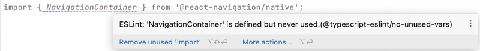

# 24. ESLint et Prettier

# 24. ESLint et Prettier

## 24.1 Changer le niveau de sévérité des règles ESLint

Lorsqu'une règle ESLint est définie avec le niveau 2 ou 'error', le code qui enfreint cette règle apparaît avec un souligage ondulé rouge.

Lorsqu'elle est définie avec le niveau 1 ou 'warn', elle apparaît surlignée en beige.

Si le surlignage rouge vous agresse, il suffit de redéfinir les règles désirées dans le fichier .eslintrc.js avec le niveau 'warn'.

Fichier .eslintrc.js

module.exports = {  
  root: true,  
  extends: '@react-native',  
  rules: {  
    'react-native/no-inline-styles': 'warn',  
    '@typescript-eslint/no-unused-vars': 'warn',  
  },  
};

Ceci est particulièrement utile pour les règles [Prettier](https://prettier.io/) qui, après tout, ne sont pas des erreurs qui empêchent le bon fonctionnement de l'application.

Fichier .eslintrc.js

rules: {  
  ...,  
  'prettier/prettier': 'warn',  
 },

## 24.2 Désactiver ESLint

## Désactiver une seule règle pour un fichier

D'abord, repérez le nom de la règle que vous désirez désactiver. Il suffit d'écrire du code qui transgresse cette règle puis de pointer la souris sur le code en erreur.

Pour désactiver cette règle, entrez ceci dans le haut du fichier en remplaçant @typescript-eslint/no-unused-vars par le nom de la règle à désactiver :

React Native

/\* eslint-disable @typescript-eslint/no-unused-vars \*/

Pour désactiver plusieurs règles, il faut les séparer par des virgules.

React Native

/\* eslint-disable @typescript-eslint/no-unused-vars, react-native/no-inline-styles \*/

## Désactiver toutes les règles pour un fichier

Pour ne plus voir les avertissements ESLint dans un seul fichier, ajoutez ceci dans le haut du fichier :

React Native

/\* eslint-disable \*/

## Désactiver une règle pour tous les fichiers

Si vous désirez qu'une règle ne soit plus prise en compte dans tous les fichiers du projet, il faut lui donner le niveau de sévérité 0 ou 'off' dans le fichier .eslintrc.js.

Fichier .eslintrc.js

module.exports = {  
  root: true,  
  extends: '@react-native',  
  rules: {  
    '@typescript-eslint/no-unused-vars': 'off',  
  },  
};

Ceci permet notamment de désactiver les règles Prettier, qui sont sans effet sur le fonctionnement de l'application.

Fichier .eslintrc.js

rules: {  
  ...,  
  'prettier/prettier': 'off',  
},

## Désactiver toutes les règles pour tous les fichiers

La façon la plus simple de complètement désactiver ESLint d'un projet sans pour autant le supprimer consiste à créer un fichier nommé .eslintignore à la racine du projet et d'y ajouter une seule ligne :

Fichier .eslintignore

\*\*/\*.\*

## Pour plus d'information

« Configure Rules ». ESLint. <https://eslint.org/docs/latest/use/configure/rules>

« Rules Reference ». ESLint. <https://eslint.org/docs/latest/rules/>

« eslint-plugin-react-native ». GitHub. <https://github.com/Intellicode/eslint-plugin-react-native>

« Ignore Files ». ESLint. <https://eslint.org/docs/latest/use/configure/ignore>